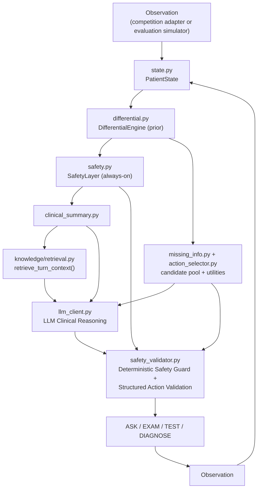
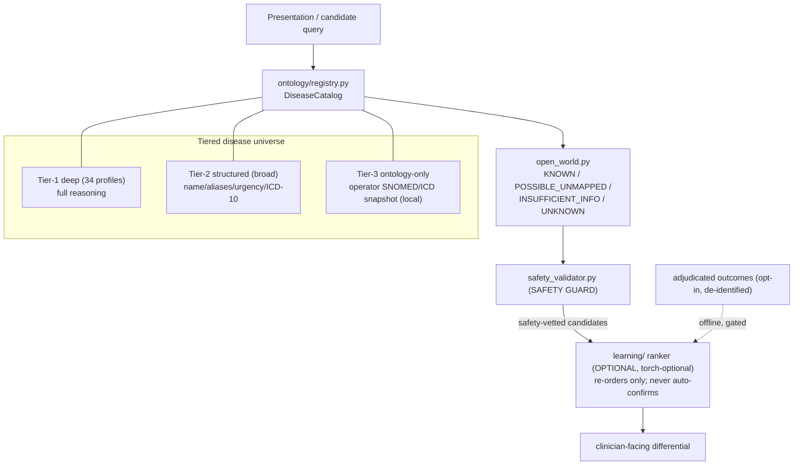

# N.O.V.A. 2026 Doctor Agent

A conversational medical-diagnosis agent (**ASK / EXAM / TEST / DIAGNOSE**) built for the N.O.V.A.
2026 competition as an independent, standalone `nova_agent` module. It reasons iteratively from a
limited initial presentation toward a differential diagnosis, actively guards against missing
time-critical ("can't-miss") conditions, and always submits a final diagnosis within a hard
60-turn limit.

Everything below reflects verified, executed behavior (`pytest tests/`, `evaluation.benchmark`,
`evaluation.ablation`, `evaluation.adversarial`, `scripts/preflight_competition.py`, and a real
standalone subprocess run of `submission/`) -- see [Known Limitations](#9-known-limitations) for
what is *not* yet verified.

**Verification status** (these are three genuinely different claims -- never conflate them):
- **Code / test CI**: READY -- 121 unit tests, the full local benchmark suite (tuning, held-out,
  generalization-v2, stress), adversarial, stability, ablation, and submission-build checks all pass
  under the deterministic `mock` LLM provider, and are enforced in CI (see `.github/workflows/`).
- **Real competition LLM (a live model actually generating turns)**: NOT VERIFIED -- no live call to
  a real model has been observed in this environment (no GPU/API access at implementation time); the
  HTTP client, prompt construction, and parse/repair/fallback path are only unit- and
  subprocess-tested against scripted/mocked responses.
- **Official N.O.V.A. 2026 competition API**: NOT VERIFIED / PLACEHOLDER -- no official interface
  document was published at implementation time, so `competition/schema.py` and
  `competition/adapter.py` are an explicit, disclosed placeholder behind the adapter boundary.

> No official N.O.V.A. 2026 Agent API/interface document was available at implementation time.
> Everything competition-protocol-shaped lives behind `competition/adapter.py` + `schema.py` (an
> explicit adapter pattern), so the real interface can be dropped in without touching the clinical
> reasoning engine -- see [Submission](#7-submission--competition-runtime) below.

## 1. Why an agent, not just a prompt

A single "diagnose this patient" LLM call can't do three things a real triage workflow needs:
guarantee a hard-coded set of critical diagnoses is never silently dropped from consideration,
guarantee a duplicate/hallucinated action is never executed, and guarantee a final diagnosis is
always produced before a turn budget runs out. This repo answers that with a hybrid: **LLM
Clinical Reasoning + Deterministic Safety Guard + Structured Action Validation**, not a
deterministic decision tree that an LLM merely rephrases, and not an LLM given free rein with no
guardrails either.

## 2. Architecture



- The deterministic engine (`differential.py`/`safety.py`/`missing_info.py`/`action_selector.py`)
  always runs first, producing a *prior* differential, safety findings, and a scored, legal
  candidate pool (every non-duplicate legal ASK/EXAM/TEST, not one pre-picked "correct" action).
- `llm_client.py` gets that prior plus RAG-retrieved knowledge and may re-rank the differential,
  add evidence, **introduce a diagnosis outside the local knowledge base**, and select *any* legal
  candidate -- not only the highest-utility one.
- `safety_validator.py` is the **only** place that ever overrides the LLM, for an explicit, short
  list of hard violations (below). Everything else the LLM chooses executes as-is. Proven, not
  just asserted -- see `tests/test_hybrid_and_robustness.py::test_llm_can_change_differential` /
  `test_llm_can_select_valid_non_deterministic_candidate`.

### 2.1 Open-world ontology + optional learning ranker

N.O.V.A. is not limited to a fixed disease list. A **tiered disease universe** and an **optional**
deep-learning ranker sit alongside the deterministic engine. N.O.V.A. offers a **broad,
ontology-backed differential diagnosis with explicit uncertainty** — it does **not** claim to
diagnose "all diseases" or achieve "100% accuracy." Conditions outside its curated knowledge are
surfaced as *possible* or *unknown*, never forced into a label.



- **Priority invariant:** `Safety Guard > ML Ranker > LLM`. The ranker only re-orders an
  already-safety-vetted list; it can never resurrect an excluded candidate, outrank a critical one,
  or show a probability without a fitted calibrator.
- **Isolation:** `learning/` (and torch) are **never** part of the competition submission or the
  core runtime; the ontology layer makes **no external terminology calls**; a NOVA prediction is
  **never** used as a training label. See `docs/ontology/*` and `docs/learning/*`.
- Coverage numbers are reported from the actual catalog by
  `python scripts/report_disease_coverage.py` — never aspirational.

## 3. The ASK / EXAM / TEST / DIAGNOSE loop

Each turn: the deterministic engine proposes a scored candidate pool -> the LLM reasons over it
and picks an action (or introduces a novel one) -> `safety_validator.py` either accepts it or
overrides it. An override happens only for: a DIAGNOSE while a dangerous, unresolved diagnosis
remains (including one the LLM itself introduced -- `resolution.py`); a `key`/`content` mismatch on
DIAGNOSE (e.g. key resolves to GERD, content says "Acute MI"); a duplicate action; an unknown
action key that can't be canonicalized onto the real taxonomy (`action_canonicalizer.py`); an
unrecognized action type; no usable LLM output; or the turn limit. A novel LLM-proposed action
(e.g. "CTA chest") is canonicalized onto the real taxonomy (`ct_chest_angio`) before being rejected
outright -- see [Hybrid candidate expansion](#4-safety--hybrid-candidate-expansion) below.

## 4. Safety & hybrid candidate expansion

`safety.py` raises a `SafetyFinding` from four independent, chief-complaint-tag-gated triggers
(never a blanket check): symptom-keyword overlap against 14 time-critical diagnoses, vital-sign
thresholds (`vitals_parser.describe_vital_sign_abnormalities`), demographic risk (e.g.
reproductive-age female + abdominal pain -> ectopic pregnancy considered), and medication risk
(e.g. anticoagulant + headache -> intracranial hemorrhage risk raised). Any active finding is
guaranteed to stay in the differential even if the LLM's own output dropped it.

A dangerous diagnosis is "resolved" (`resolution.py`) only via explicit contradictory evidence, or
-- for a known diagnosis -- completing its `minimum_workup` (a small rule-in/rule-out subset, e.g.
ACS: ECG + troponin, not also CXR, to avoid unnecessary testing). **A novel/unknown diagnosis the
LLM introduces is never auto-resolved just because there's no knowledge-base entry to check a
workup against** -- the actual bug this fixes: an LLM-flagged `dangerous_if_missed=True` diagnosis
outside the 34-disease catalog used to be silently unblockable. Regression-tested in
`tests/test_safety_regression.py`.

## 5. RAG

`knowledge/retrieval.py`'s `retrieve_turn_context()` assembles, per turn, only what's relevant:
one chief-complaint guideline sentence, a one-line note per dangerous diagnosis in the top-3
differential, and notes for the specific tests under consideration -- never the whole knowledge
base. Feature-flagged (`NOVA_RAG_ENABLED`, default on). Every snippet is honestly labeled
`internally_authored_heuristic` -- see [`knowledge/PROVENANCE.md`](nova_agent/knowledge/PROVENANCE.md):
nothing in this repo cites a fabricated external source.

## 6. Evaluation & results

```bash
pytest tests/ -v                        # 121 tests
python -m evaluation.benchmark --generalization-v2 --stress  # tuning + held-out + generalization-v2 + stress, full metrics
python -m evaluation.benchmark --held-out-only
python -m evaluation.generalization_benchmark
python -m evaluation.ablation           # A (basic) -> F (+retrieval) component contribution
python -m evaluation.adversarial        # crash-resistance / reliability checks
python -m evaluation.stability --runs 5 # run-to-run determinism (agreement/variance)
python -m evaluation.failure_analysis   # automated root-cause classification of held-out misses
python -m evaluation.tune --random 20   # local weight calibration (tuning set only, never held-out)
python -m evaluation.blind_benchmark    # blind_cases_v3.py -- reference only, see terminology below
python -m evaluation.blind_benchmark_v4 # blind_cases_v4.py -- reference only, see terminology below
python -m evaluation.blind_benchmark_v5 # blind_cases_v5.py -- the untouched final check, see below
python scripts/check_eval_leakage.py    # best-effort static scan for blind-set leakage into agent core
python -m evaluation.benchmark --generalization-v2 --stress --save-json evaluation/latest_results.json && python scripts/check_readme_numbers.py
```

**Evaluation set terminology** (each name below is used consistently everywhere else in this file):

| Name | File | Role |
|---|---|---|
| **Tuning** | `evaluation/cases.py` (8) | What `config.py`'s defaults were iterated against. |
| **Held-out regression** | `evaluation/held_out_cases.py` (18) | Never used to tune a default or drive a fix -- a genuinely blind regression check on every run. |
| **Development generalization** | `evaluation/generalization_cases_v2.py` (18) | Not used for the *initial* tuning pass, but two of its failures *were* later analyzed and used to drive real fixes (see below) -- read its 100% as "generalization-informed, fix-verified," not untouched. |
| **Targeted stress** | `evaluation/generalization_stress_cases.py` (8) | A small follow-up set deliberately built to probe the exact fix patterns above, plus negative controls that they don't overfire. |
| **Blind v3 reference** | `evaluation/blind_cases_v3.py` (32) | A first blind check, run once and reported as-is. No longer used for tuning -- kept only as a failure-analysis reference (see [Known Limitations](#9-known-limitations)). Its number below is a fresh re-measurement against the current codebase (the file itself was never edited), not the number it scored when first authored -- structural changes since then shift a frozen set's score without anyone tuning toward it. |
| **Blind v4 reference** | `evaluation/blind_cases_v4.py` (34, one per knowledge-base diagnosis) | A second blind check, authored and run once after an earlier structural fix round. Same reference-only, re-measured status as Blind v3. |
| **Blind v5 reference** | `evaluation/blind_cases_v5.py` (44) + `evaluation/blind_benchmark_v5.py` + `evaluation/blind_v5_manifest.json` | This round's untouched final check for the *previous* structural rewrite (chief-complaint confidence routing, diagnostic/severity score separation). Now reference-only, re-measured against the current codebase (`nova_agent/` and this case file untouched since authoring). |
| **Blind v6 reference** | `evaluation/blind_cases_v6.py` (54) + `evaluation/blind_benchmark_v6.py` + `evaluation/blind_v6_manifest.json` | The prior round's untouched final check. **Now reference-only** as of the pilot-readiness workstream, because a reasoning-code change was made after it (the Stage 4 glucose unit-safety guard) -- so a fresh untouched Blind v8 was authored (see below). Original first-run: Authored and hash-frozen (`blind_v6_manifest.json`) only after this round's structural rewrite (`ClinicalPresentation` multi-concept extraction, `candidate_generator.py` dynamic candidate generation, the `production/` service layer) was complete and re-verified against the sets above, then run exactly once. Nothing in `nova_agent/` or this case file was touched in response to its result. |

`evaluation/generalization_cases_v2.py` (**18 more cases**: elderly polypharmacy,
immunocompromised, anticoagulant+antiplatelet polypharmacy, conflicting findings, vague complaints,
rare-but-dangerous, and more benign/dangerous mimics -- together exercising every one of this
repo's 34 knowledge-base diagnoses at least once) is **not the same kind of blind check**: it was
never used for the *initial* `config.py` tuning, but two of its cases' failures (a hypoglycemia
miss and a migraine-vs-stroke miss) were later analyzed and used to drive real code fixes
(`nova_agent/glucose_evidence.py`, `FEATURE_ALIASES`, `reassuring_if_present` in
`nova_agent/differential.py`) -- so its current 100.0% should be read as "generalization-informed,
fix-verified", not as a fully untouched holdout the way `held_out_cases.py` is. This is a moderate,
deliberately non-padded expansion (each case is a genuinely distinct scenario, not a reworded
duplicate), not a source of inflated headline numbers.

`evaluation/cases.py` (8 cases) is the *tuning set* current `config.py` defaults were iterated
against. `evaluation/held_out_cases.py` (18 cases) has **never** been used to tune a default or to
drive any code fix -- it exists purely as an independent regression check, and every result on it
reported anywhere in this README is a genuinely blind score.

`evaluation/generalization_stress_cases.py` (**8 more cases**) is a small,
targeted follow-up set, added after root-causing the two generalization v2 misses described below:
half the cases exercise the fix (atypical/non-diabetic hypoglycemia, migraine with aura in
different wording, stroke presenting as headache) and half are deliberate **negative controls**
checking the fix doesn't overfire (a real stroke that borrows migraine-sounding language, an
elderly new-onset dangerous headache with no migraine history, a polypharmacy weakness case that is
hyperkalemia rather than hypoglycemia, and a weakness case with a *normal* glucose result whose real
cause is a GI bleed). `scripts/check_readme_numbers.py` verifies the table below never silently
goes stale against a fresh `evaluation/latest_results.json`.

| Set | Scored Accuracy | All-Case Accuracy | Critical Recall | Critical Miss Rate | Avg Turns |
|---|---|---|---|---|---|
| Tuning (8 cases) | 100.0% | 100.0% | 100.0% | 0.0% | 14.2 |
| Held-out (18 cases, 15 scored, 13 critical) | 100.0% | 94.4% | 100.0% | 0.0% | 17.9 |
| Development generalization (18 cases, all scored, 5 critical) | 100.0% | 100.0% | 100.0% | 0.0% | 16.1 |
| Targeted stress (8 cases, all scored, 5 critical) | 100.0% | 100.0% | 100.0% | 0.0% | 16.9 |
| Blind v3 reference (32 cases, all scored, 14 critical) | 62.5% | 62.5% | 50.0% | 50.0% | 21.8 |
| Blind v4 reference (34 cases, all scored, 14 critical) | 70.6% | 70.6% | 85.7% | 14.3% | 20.9 |
| Blind v5 reference (44 cases, all scored, 20 critical) | 56.8% | 56.8% | 50.0% | 50.0% | 21.7 |
| Blind v6 reference (54 cases, all scored, 26 critical) | 59.3% | 59.3% | 46.2% | 53.8% | 20.7 |
| **Untouched Blind v8 (72 cases)** | **NOT VERIFIED (first run pending a runnable env)** | — | — | — | — |

**Blind v8** (`evaluation/blind_cases_v8.py`, 72 cases, `evaluation/blind_benchmark_v8.py`,
`evaluation/blind_v8_manifest.json`) is the pilot-readiness workstream's fresh untouched set,
authored and hash-frozen (SHA-256 `502ea339...`) **after** the only reasoning-code change in that
workstream (the Stage 4 glucose unit-safety guard) was complete and CI-verified against
held-out/generalization-v2/stress. It covers all 34 KB diagnoses plus multimorbidity, polypharmacy,
pregnancy/pelvic, trauma, GI bleeding, atypical neuro/infection, metabolic, conflicting findings,
sparse information, negative-centric, and data-freshness/wrong-unit axes, spread across
ko/en/ja/zh/mixed input (language distribution 46 en / 8 ko / 6 ja / 7 zh / 5 mixed). Its **first
run has not yet been executed** — it requires a runnable Python environment (pydantic), which the
network-isolated authoring environment does not have. Per the blind-set discipline it will be run
**exactly once** and its result transcribed as-is, never re-tuned against; until then it is
reported here as **NOT VERIFIED**. Blind v6 is now reference-only.

"Scored" excludes deliberately ambiguous/insufficient-info/unmapped-complaint stress cases (see
`evaluation/benchmark.py`'s exclusion disclosure); "All-Case" is the same correctness check applied
to every case with no exclusions, so a hard case can never be hidden from the headline number. Full
metric definitions and the local (non-official) utility-score proxy live in `evaluation/scoring.py`
and `evaluation/benchmark.py` -- never presented as an official competition score. Blind v3/v4/v5/v6
are not wired into `--save-json`/`check_readme_numbers.py` (their numbers above are transcribed by
hand from each run's own output) precisely because they must never become a silent tuning target.

**This round's actual honest number is Untouched Blind v6 (59.3% / 46.2% critical recall / 53.8%
critical miss), not Blind v3/v4/v5.** Blind v3, v4, and v5 are now explicitly **reference-only**:
this round's structural rewrite (`ClinicalPresentation` multi-concept extraction replacing
single-tag routing as the reasoning entry point, `nova_agent/candidate_generator.py`'s dynamic,
provenance-tagged candidate pooling, information-gain-based action selection with semantic
duplicate detection, and the `production/` decision-support service layer -- see
[Architecture](#2-architecture) and the changelog below) was deliberately designed and re-verified
against held-out/development-generalization/targeted-stress *without* looking at Blind v3/v4/v5's
specific miss patterns, and none of those three files were edited. All three sets' own accuracy
moved as a side effect of that structural work (v3: 62.5%->62.5% accuracy but 57.1%->50.0% critical
recall; v4: 64.7%->70.6% accuracy, 71.4%->85.7% critical recall; v5: 52.3%->56.8% accuracy,
40.0%->50.0% critical recall) -- not because anyone tuned toward or away from any of them. Blind v6
was authored fresh only after the rewrite was complete and frozen
(`evaluation/blind_v6_manifest.json` records its SHA-256 before it was ever run), and its result is
reported exactly as first measured.

**Blind v6 is a harder, broader set than v3/v4/v5 by design** (one case per all 34 knowledge-base
diagnoses *plus* twenty cases explicitly targeting multimorbidity/polypharmacy/pregnancy-pelvic/
trauma/GI-bleeding/atypical-neurologic/atypical-infection/metabolic/conflicting-findings/sparse-
information/negative-finding-centric/benign-mimic/dangerous-mimic/mixed-presentation as their own
axis), and per this round's explicit instruction it was **not** used to drive any further code or
case change. A read-only failure-category pass (no code touched) on its actual predicted diagnoses
(not just correct/incorrect) found:
  - **The 6 misses among the 20 `category="common"` cases never missed a dangerous diagnosis**:
    each landed on a different, also-non-dangerous diagnosis (e.g. asthma predicted as panic
    attack, vasovagal syncope predicted as pancreatitis) -- `critical_miss=False` on every one, so
    this failure mode is a plain ranking/differentiation gap among benign look-alikes, not a safety
    issue. The remaining critical misses cluster almost entirely in the stress-axis categories
    (`critical`, `pregnancy_pelvic`, `trauma`, `gi_bleeding`, `polypharmacy`,
    `conflicting_findings`, `dangerous_mimic`) this set was deliberately built to probe, not a
    representative sample of ordinary cases.
  - **Of the 14 critical misses, 6 still landed on a different diagnosis the knowledge base itself
    flags `dangerous: true`** (sepsis, acute coronary syndrome, diabetic ketoacidosis, or acute
    abdomen) rather than a benign one -- the safety layer correctly recognized these patients as
    needing urgent care even though it named the wrong specific emergency. The other 8 landed on a
    diagnosis NOT flagged dangerous (most often vasovagal syncope, pyelonephritis, or panic
    attack) -- a clean miss with no residual safety signal, and the more concerning failure mode of
    the two.
  - **The `dangerous_mimic` case (`Blind6_47`) is a genuine, disclosed hard case**: a patient with a
    longstanding benign diagnosis (migraine with aura) whose current episode is actually a stroke
    was diagnosed as "Migraine" -- anchoring on the benign prior-history pattern rather than the
    new-onset persistence and new atrial-fibrillation risk factor. This specific failure mode is
    exactly what this axis was built to surface, and it was surfaced, not obscured.

None of the above was acted on this round -- reported here exactly as the first-run failure
analysis, for a future round to address structurally (never by adding a Blind-v6-specific alias or
rule, which the next round's own leakage check would need to catch if it ever happened).

Ablation (`python -m evaluation.ablation`):

| Stage | Accuracy | Avg Turns | Critical Miss |
|---|---|---|---|
| A. Basic Agent (fixed checklist) | 37.5% | 7.0 | 66.7% |
| C. + Differential Engine | 100.0% | 7.0 | 0.0% |
| E. + Safety Layer | 100.0% | 11.6 | 0.0% |
| F. + Retrieval | 100.0% | 11.6 | 0.0% |

(F vs. E shows no delta under the default `mock` provider by construction -- retrieval only feeds
the real-LLM prompt, which `mock` never constructs; see `test_rag_context_reaches_llm`.)

## 7. Submission & competition runtime

```
submission/
  run.py               # JSON-lines protocol on stdin/stdout, or --interactive
  requirements.txt      # pydantic only -- no `openai` package dependency (stdlib urllib HTTP client)
  nova_agent/, competition/   # copied from the repo root -- never hand-edited
```

Regenerate after any change to `nova_agent/`/`competition/`: `python scripts/build_nova_submission.py`
(`tests/test_safety_regression.py::test_submission_source_sync` fails CI on drift).

`submission/run.py` defaults `NOVA_LLM_PROVIDER=competition` and runs a startup preflight
(`client.preflight()`) before the first turn: if the real endpoint is unreachable, it prints a
clear diagnostic to stderr and continues on the deterministic per-turn fallback (dev/runtime
fallback policy), rather than silently spending the whole case on `mock`. Before a real run, gate
on `scripts/preflight_competition.py`, which prints `READY`/`NOT READY` and exits non-zero unless a
real provider is configured, reachable, produces legal structured/action output, **and actually
succeeded at least once** (`real_llm_success_count_at_least_1` -- deliberately distinct from
`structured_output_and_action_validation`: the deterministic fallback alone can already produce a
well-formed action, so that check passing is not evidence the real model said anything):

```bash
NOVA_LLM_PROVIDER=competition NOVA_COMPETITION_BASE_URL=http://localhost:8000/v1 \
  python scripts/preflight_competition.py
python scripts/smoke_real_llm.py   # prints SKIPPED_REAL_LLM if no real provider configured,
                                    # otherwise exits non-zero unless a real call actually succeeded
```

**Competition mode never silently completes a case on the fallback alone.** If a case reaches
DIAGNOSE in a non-mock provider mode having never had a single real-LLM call succeed, even after
each turn's own bounded per-call retry, `competition/adapter.py`'s `NovaCompetitionAgent` makes one
more bounded round of retries (`_DIAGNOSE_ZERO_LLM_SUCCESS_RETRIES`, currently 2) specifically at
the DIAGNOSE gate. If a real call succeeds during that retry, the case proceeds normally with
`metadata["real_llm_verified"] = True`. If every attempt still fails, `act()` raises
`RealLLMUnavailableError` instead of returning a DIAGNOSE action -- a deterministic-fallback-only
result is never disguised as a normal, successful competition completion. `submission/run.py`
treats this distinctly from an ordinary malformed-observation error: it prints a `FATAL` line to
stderr and exits non-zero rather than emitting a fake recoverable action. Dev/mock mode is
unaffected: reaching DIAGNOSE purely on deterministic reasoning there is normal, not an error (see
`test_competition_adapter_raises_on_zero_real_llm_success` and
`test_competition_adapter_recovers_via_bounded_retry_when_llm_becomes_available`).

**CI is split into two jobs** specifically so a submission-readiness problem is never invisible
behind a green dev build: `nova-agent` (always runs, mock provider only, must always stay green)
and `competition-readiness` (skipped cleanly when no real-provider secret is configured; once any
is, it runs `preflight_competition.py` and `smoke_real_llm.py` for real, with no `|| true` masking
-- a real-LLM problem there fails CI).

`competition/schema.py` is an explicit, disclosed **placeholder** (no official N.O.V.A. 2026 API
was published at implementation time) -- update it and `competition/adapter.py` once the real one
ships; nothing else needs to change, since `nova_agent/`, `evaluation/`, `submission/`, and
`tests/` only ever depend on `PatientState`/`AgentAction`.

## 8. Production decision-support API

```
production/
  api.py            FastAPI app: POST /v1/cases, /v1/cases/{id}/observations, /v1/cases/{id}/decide,
                     GET /v1/cases/{id}, /health, /ready, /metrics
  auth.py           API-key auth + RBAC (clinician/reviewer/admin/service)
  repository.py     CaseRepository / AuditRepository (in-memory implementation shipped; see below)
  schemas.py, validation.py, errors.py, circuit_breaker.py, redaction.py, logging_config.py,
  metrics.py, versions.py, config.py, requirements.txt, Dockerfile
```

Wraps `nova_agent.orchestrator.DoctorAgent`, unmodified, behind a real service layer: API-key auth
with least-privilege roles, strict Pydantic schemas (`extra="forbid"`), a thread-safe in-memory
`CaseRepository`/`AuditRepository` with idempotent event application, structured JSON logging with
PHI-minimized-by-default free text, in-process metrics, a circuit breaker, and a small non-root
Docker image. Every clinically-facing response carries a fixed
`"Decision Support / Not Autonomous Medical Diagnosis / Clinician Review Required"` banner and
`clinician_review_required: true` -- this is decision support, never autonomous diagnosis, and the
system never calls out to anything capable of executing a prescription or treatment order.

**Deliberately isolated from the competition submission**: `production/` is never imported by
`nova_agent/`/`competition/`/`submission/`, and `scripts/build_nova_submission.py` never copies it
-- its own dependencies (FastAPI, uvicorn) never reach the competition artifact, and a
production-only failure never blocks it (see the `production` job in
`.github/workflows/nova-ci.yml`, fully independent of the `nova-agent`/`competition-readiness`
jobs).

Full documentation: `docs/nova/architecture.md`, `deployment.md`, `security.md`,
`clinical_safety.md`, `operations.md`, `runbook.md`.

**A second production path, `backend/` (backend-integrated), also exists.** Rather than a second
standalone API, `backend/app/services/nova_service.py` wraps the same, unmodified
`nova_agent.orchestrator.DoctorAgent` behind this repository's existing SynexAgent FastAPI app
(`backend/app/main.py`) -- reusing its real OIDC/session auth, RBAC, SQLite audit store, and
idempotency infrastructure instead of a parallel implementation, and adding a genuine FHIR/EMR
normalization bridge (`backend/app/services/nova_fhir_mapper.py`) that `production/` never had.
The `/v1/nova/*` endpoints: `POST /v1/nova/cases`, `POST .../{id}/observations` (idempotent by
`observation_id`), `POST .../{id}/decide`, `GET .../{id}`, `PATCH .../{id}/locale` (mid-case
language switch), `POST .../{id}/close`, plus `GET /health`, `GET /health/subsystems`,
`GET /ready` (distinct from `/health`) and `GET /v1/nova/metrics` (admin-only). Same clinical safety contract
(`clinician_review_required: true`, a fixed safety banner, no endpoint ever touches a
medication/lab order repository). Full documentation:
`docs/NOVA_PRODUCTION_ARCHITECTURE.md`, `NOVA_SECURITY.md`, `NOVA_CLINICAL_SAFETY.md`,
`NOVA_OPERATIONS.md`, `NOVA_DEPLOYMENT.md`, `NOVA_RUNBOOK.md`. Verified via a
dedicated `production-backend` CI job (`.github/workflows/nova-ci.yml`, independent of every other
job) covering 35 new backend tests (full lifecycle, the 4-role RBAC matrix, concurrent-case and
concurrent-observation safety, FHIR-mapper unit coverage, prompt-injection/control-character
rejection, circuit-breaker behavior), a load smoke test
(`scripts/load_smoke_backend.py`), and a container build + `/health`+`/ready` smoke test.

**What is explicitly NOT verified, for both paths**: clinical validation, regulatory review, and
institutional security review have not been performed -- "production-grade code" here means the
practices above are implemented and tested, not that any of those three have signed off (see
`docs/NOVA_CLINICAL_SAFETY.md`'s own statement of this).

**Persistence (updated):** the authoritative hospital path (`backend/`) now has a durable,
restart-surviving, multi-instance-safe persistence layer -- `PostgresNovaCaseRepository` and
`PostgresAuditStore` (`backend/app/services/nova_repository.py`, `audit.py`), selected via
`NOVA_POSTGRES_URL`, with optimistic-concurrency (`version` column), observation idempotency
(`PRIMARY KEY (case_id, observation_id)`), a `state_schema_version` column, and an ordered SQL
migration runner (`nova_migrations.py`). This is exercised in CI by a dedicated
`postgres-integration` job against a real `postgres:16` service (repository, concurrency, audit, and
migration tests -- a CI skip is turned into a failure via `NOVA_CI_REQUIRE_POSTGRES=1`, so the DB
integration can never be silently skipped). `production_guard.py` refuses to start the backend in
production mode on a non-durable (local/in-memory SQLite) store. The standalone `production/`
package remains a **reference/lightweight** deployment with an in-memory repository by design (not
the hospital path). `backend/`'s existing FHIR/OIDC/SMART code (reused unchanged by N.O.V.A.'s
integration) has never been exercised against a real hospital IdP or FHIR server -- see
`docs/NOVA_SECURITY.md`.

### Production readiness matrix

| Dimension | `production/` (standalone) | `backend/` (integrated) |
|---|---|---|
| CODE | READY | READY |
| LOCAL VALIDATION | READY (181+53 tests, load smoke) | READY (483 tests incl. 35 new, load smoke) |
| CONTAINER | READY (image builds + `/health`+`/ready` smoke pass in the `production` CI job) | READY (image builds + `/health`+`/ready` smoke pass in the `production-backend` CI job) |
| PERSISTENCE | REFERENCE (in-memory by design; lightweight/standalone path) | READY-IN-CI (durable Postgres repo + audit + migrations, verified by the real-DB `postgres-integration` CI job; real SNUBH DB deployment still NOT VERIFIED) |
| AUTH | READY (API-key + RBAC, tested) | READY (reuses existing OIDC/session + RBAC, tested) |
| FHIR INTEROP | N/A (no FHIR integration in this path) | PARTIAL (real mapping code exists and is unit-tested; never exercised against a real hospital FHIR server) |
| REAL LLM | NOT VERIFIED (mock provider only, no live call made) | NOT VERIFIED (mock provider only, no live call made) |
| CLINICAL VALIDATION | NOT VERIFIED | NOT VERIFIED |
| SECURITY REVIEW | NOT VERIFIED | NOT VERIFIED |
| REGULATORY REVIEW | NOT VERIFIED | NOT VERIFIED |

Neither path should be described as "hospital-ready" on the strength of this matrix alone --
CODE/LOCAL VALIDATION/AUTH being READY means the software does what it claims under test, not that
it has cleared the four rows still marked NOT VERIFIED.

## 9. Known Limitations

- **Knowledge base breadth**: 34 diagnoses across 15 chief-complaint tags -- far from exhaustive;
  the LLM can introduce diagnoses outside this set, but the deterministic prior only covers these.
- **Generalization v2 was 88.9%, with two real misses, as of the previous round** -- both were
  root-caused (not patched around the specific case text) and are now fixed, verified at 100.0% on
  the existing held-out and generalization-v2 sets plus a new 8-case stress set (see the table
  above), with no critical miss, no accuracy regression, and no increase in duplicate/malformed
  output anywhere:
  - *Elderly polypharmacy hypoglycemia* (`Weakness01_ElderlyPolypharmacyHypoglycemia`) was losing to
    diabetic ketoacidosis because of two literally-garbled `confirmatory_findings` entries in the
    knowledge base (`"blood glucose 4"` / `"blood glucose 3"`) that matched almost any glucose
    result via keyword overlap regardless of the actual number -- removed, and replaced with a
    principled numeric glucose reader (`nova_agent/glucose_evidence.py`) using the standard clinical
    thresholds (ADA hypoglycemia <70 mg/dL; DKA-range hyperglycemia >=250 mg/dL, never fitted to a
    benchmark case's specific value), plus a small, explicitly-scoped medication-class alias table
    (glipizide/glyburide/insulin -> the KB's existing `"sulfonylurea use"`/`"insulin use"` risk
    factors) and a matching `hypoglycemia`-targeting entry in the existing `medication_risk_rules`
    infrastructure.
  - *Migraine vs. ischemic stroke* (`Headache04_ReassuringMigraine`) was a 0.0-vs-0.0 score tie
    resolved by disease-declaration order, because migraine's own typical features never matched lay
    phrasing ("throbbing" vs. the KB's "pulsating", "sensitive to light" vs. "photophobia") and an
    objective negative exam finding ("no focal neurological deficit") had no mechanism to lower
    stroke's score at all. Fixed with (a) a small **feature-local** alias table
    (`FEATURE_ALIASES` in `nova_agent/differential.py`) -- each alias is attached to and only ever
    used for the ONE exact knowledge-base phrase it's keyed to, never a global text substitution
    (the earlier `clinical_synonyms.py` global-synonym attempt caused broad cross-disease
    regressions and was reverted; this is a deliberately narrower design learning from that), and
    (b) a new opt-in `reassuring_if_present` per-disease field that lets an objective negative exam
    finding apply a bounded, soft penalty (never a hard exclusion) to a specific dangerous
    diagnosis.
  - The held-out `unnecessary_test_rate` metric was also investigated (spec-requested): about half
    of the previously-reported "unnecessary" tests were a metric-definition artifact -- rule-out
    tests for a plausible, evidence-driven alternative that simply wasn't in the metric's
    dangerous-diagnoses-only allowlist (e.g. ruling out a urinary source of an elderly patient's
    altered mental status). `evaluation/simulator.py::_relevant_test_ids` now also credits any
    diagnosis the agent's own differential engine actually ranked at #1 or #2 at some point during
    the case, not only diagnoses flagged `dangerous: true` in the knowledge base.
  - As with the earlier reverted attempt, every one of these fixes is scoped and disease/phrase-
    level, not a blanket rule -- see `nova_agent/differential.py`'s `FEATURE_ALIASES` docstring for
    the full list of what's covered and what deliberately isn't.
- **Structural rewrite this round: chief-complaint confidence routing +
  diagnostic/severity/safety_priority separation.** Triggered by Blind v3's original 65.6%/42.9%
  critical-miss result (now historical -- see the table above): `chief_complaint.py` was rewritten
  from a flat keyword list to a 3-level matcher (exact canonical term / scoped lay alias / fuzzy
  word-overlap fallback) that reports a `ChiefComplaintRoutingResult` (primary tag, score margin,
  match type, HIGH/MEDIUM/LOW confidence), which `differential.py` now uses to size the candidate
  pool to how sure the routing actually is, instead of either a single hard-routed tag or an
  untargeted whole-catalog dump. Separately, `nova_agent/differential.py`'s `diagnostic_score` was
  made **strictly disease-specific** (a diagnosis's own typical_features/confirmatory_findings/
  numeric labs only) after an earlier version of this same round briefly added a *generic*
  physiologic-derangement bonus to every `dangerous: true` diagnosis's score directly and that
  measurably let vitals shared by several dangerous diagnoses at once unfairly advantage whichever
  one happened to be eligible -- reverted before it ever reached PR review. `severity_evidence.py`'s
  `severity_score` (0..1, physiologic derangement magnitude) is now a genuinely separate axis,
  consumed only by `stop_policy.py`'s `safety_priority`-style gate (keeps a dangerous diagnosis
  actively tracked as an unresolved alternative even at LOW diagnostic confidence, when the patient
  looks severely deranged AND that diagnosis already has some real evidence of its own -- never
  added to its score). `nova_agent/syndrome_relationships.py` adds optional localized-source/
  systemic-syndrome metadata (documentation only, not a functional gate -- e.g. pyelonephritis and
  sepsis can and do coexist in the same differential; there is no hardcoded
  `pyelonephritis -> sepsis` escalation rule anywhere).
- **Blind v3, v4, and v5 are now reference-only, not this round's honesty check.** All three were
  run once, unmodified, when originally authored; the table above re-measures them against the
  current codebase (still without editing any of the three files) purely to show how a prior
  round's structural changes moved a frozen set's score as a side effect, never as a target.
- **This round's structural rewrite: `ClinicalPresentation` multi-concept extraction, dynamic
  candidate generation, information-gain action selection, and a production service layer.**
  Triggered by Blind v5's own finding that most of its critical misses traced to a single-best-tag
  chief-complaint router losing real information whenever a presentation carried several
  simultaneous symptom concepts at once (a stroke presentation described as "can't speak well and
  my arm won't work" routing on only one of `aphasia`/`focal_weakness`, for instance). Replaced with
  `nova_agent/clinical_presentation.py`'s `extract_presentation()`, which pulls every plausible
  concept simultaneously (never a single winner-take-all tag) plus onset/duration/severity/body
  regions, built on top of -- not replacing -- `chief_complaint.py`'s existing matcher (kept as a
  compatibility layer several other modules still depend on). `nova_agent/candidate_generator.py`
  replaces the old confidence-tiered pool sizing with an explicit, provenance-tagged pipeline
  (`symptom_match` / `risk_match` / `objective_finding` / `safety_candidate` per candidate, ~8-15
  diagnoses, full-catalog dump only as a genuine last resort when nothing matched at all) --
  `DifferentialItem.candidate_sources` now surfaces this provenance for downstream consumers and,
  in `production/`, for the API's own explainability fields. Fixed two genuine bugs found via the
  full regression suite while building it: a trim-priority bug that let the fixed cross-cutting
  safety-net entries crowd out a directly, strongly-matched non-dangerous diagnosis out of the pool
  (protection from trimming is now "has real evidence", never "is flagged dangerous"), and a
  fallback-ordering bug that made the whole-catalog last-resort fallback permanently unreachable
  once the safety net always made the pool non-empty. Also fixed a resulting `safety.py` regression
  (the fixed 8-entry safety net trivially satisfying its own "already relevant to this case" check
  on every case, inflating turn counts) by scoping that check to diagnoses with real evidence, not
  safety-candidate-only ones -- propagated through `safety_validator.py`'s LLM-differential merge,
  which was silently dropping `candidate_sources` on the rebuilt differential. Full details and the
  production service layer built alongside this rewrite are in `docs/nova/architecture.md`.
- **Blind v6 (54 cases, one per knowledge-base diagnosis plus twenty cases explicitly targeting
  multimorbidity/polypharmacy/pregnancy-pelvic/trauma/GI-bleeding/atypical-neurologic/atypical-
  infection/metabolic/conflicting-findings/sparse-information/negative-finding-centric/benign-
  mimic/dangerous-mimic/mixed-presentation), authored and hash-frozen
  (`evaluation/blind_v6_manifest.json`) only after the rewrite above was complete, then run exactly
  once: **59.3% accuracy, 46.2% critical recall, 53.8% critical miss** (see the table above and the
  failure-category breakdown just above this section) -- both accuracy and critical recall improved
  over Blind v5's re-measured reference number, but the generalization gap on genuinely atypical
  critical presentations remains substantial and is **not** something this round claims to have
  solved. **Not** acted on this round per the explicit instruction not to tune against it.
- **No live real-LLM call observed in this environment** (no GPU/API keys available at
  implementation time) -- the HTTP integration, prompt construction, and parse/repair/fallback path
  are unit- and subprocess-tested with scripted/mocked clients and a local HTTP test server, not
  exercised against a live gpt-oss-20b or Claude response end-to-end.
- **Matching is keyword/entropy-based, not an embedding model** (`matching.py`) -- deliberate, for
  determinism and testability, but misses synonym pairs neither stemmed nor keyword-matched (e.g.
  "hypoxia" vs. "hypoxemia" currently do not cross-match).
- **`evaluation.tune`'s search space is small** (3 weights) and only optimizes against the tuning
  set; a starting point for manual calibration, not an automated tuner.
- **Latency / LLM-calls-per-case / token usage** are measured ad hoc by `scripts/smoke_real_llm.py`
  against a single turn, not systematically across the full evaluation harness.
- **Turn count stays high on cases with multiple simultaneous can't-miss differentials, and this
  was investigated, not fixed.** Traced one concrete example end to end
  (`Dyspnea05_TensionPneumothorax`, 25 turns): its severe vitals (SpO2 86%, marked tachycardia/
  tachypnea) trip red-flag criteria for five different critical conditions at once (ACS,
  anaphylaxis, DKA, PE, sepsis) alongside the correct diagnosis, and `stop_policy.py` requires each
  one's own `minimum_workup` (not its full discriminating panel -- already a bounded subset) to
  resolve before allowing DIAGNOSE, even once the correct diagnosis has overwhelming confirmatory
  evidence by turn 3-4. This is bounded, clinically-defensible due diligence for a genuinely
  undifferentiated critically-ill presentation, not an unbounded loop -- but no safe way to let an
  overwhelming top-1 lead short-circuit it was found without risking exactly the kind of
  critical-recall regression this whole project has been built to avoid, so no code was changed.
- **No knowledge-base expansion this round, by evidence, not by default.** Checked whether any of
  Blind v3's, v4's, v5's, or v6's cases had a ground-truth diagnosis missing from the 34-entry
  knowledge base entirely: none did across any of the four sets -- every miss on every blind set was
  a ranking/routing problem on an already-present diagnosis, never a missing one. Padding the KB
  without that evidence would just be guessing.
- **Production service layer (`production/`) exists and is tested, but is explicitly NOT clinically
  validated, regulatory-reviewed, or security-reviewed.** See `docs/NOVA_CLINICAL_SAFETY.md` and
  `docs/NOVA_SECURITY.md` for exactly what has and has not been verified, and this file's own
  Production Readiness summary in the session report this round produced (not reproduced verbatim
  here to avoid the two ever silently drifting apart -- read the docs, not a stale copy).
- **The in-memory `CaseRepository`/`AuditRepository` in `production/repository.py` is process-memory-
  only.** That is correct for the `production/` **reference/lightweight** path by design. The
  authoritative hospital path (`backend/`) does NOT rely on it: it ships a durable
  `PostgresNovaCaseRepository`/`PostgresAuditStore` (verified by the real-DB `postgres-integration`
  CI job) -- see `docs/NOVA_DEPLOYMENT.md`'s persistence section for the exact contract.
- **The production Docker image build was verified structurally, not end-to-end, in this
  development sandbox** (dependency-file path resolution and `pip`'s dependency graph resolve
  correctly; the sandbox's own network policy blocks its Docker build network from reaching PyPI, so
  the full image build and a running-container smoke test could not be completed there). The
  `production` CI job builds the image and runs a container smoke test under GitHub Actions' normal
  network access on every push/PR -- check that job's latest run, not this note, for the current
  verified state.
- **A second, backend-integrated production path now also exists (`backend/app/services/
  nova_service.py` + `/v1/nova/*`), reusing this repository's existing SynexAgent FastAPI app's
  auth/RBAC/audit/idempotency instead of a parallel implementation, plus a real FHIR/EMR
  normalization bridge (`nova_fhir_mapper.py`) the standalone `production/` path never had.** See
  the Production readiness matrix in section 8 for exactly what is/isn't verified on this path;
  it carries the same NOT VERIFIED clinical-validation/regulatory/security-review status as
  `production/`, plus its own disclosed gaps: `NovaCaseRepository` is process-memory-only (same
  limitation `production/repository.py` has, not a new one); `nova_parse_failure` (one metric from
  the original spec list) is not tracked, since `PatientState` does not expose a distinct
  LLM-parse-failure counter separate from its general failure count and this was left absent
  rather than fabricated from a signal that doesn't exist; the container build was verified
  structurally, not end-to-end, in this development sandbox (blocked by Docker registry
  rate-limiting pulling the frontend build stage's base image -- a different sandbox-network
  limitation than the one `production/Dockerfile` hit, not a code defect either time) -- the
  `production-backend` CI job builds and smoke-tests it for real under GitHub Actions.

## 10. Installation

```bash
python3 -m venv .venv && source .venv/bin/activate
pip install -r requirements-nova.txt       # runtime only: pydantic
pip install -r requirements-nova-dev.txt   # + pytest, for the test suite
```

`nova_agent` has no required dependency on the vendored SynexAgent backend at all
(`tests/test_hybrid_and_robustness.py::test_standalone_without_backend`).

```python
from nova_agent.orchestrator import DoctorAgent

agent = DoctorAgent()  # NOVA_LLM_PROVIDER=mock by default: fully offline, deterministic
state = agent.new_case("case1", "chest pain", demographics={"age": 58, "sex": "male"})
while True:
    action, llm_output, differential = agent.decide(state)
    print(action.action_type, action.content)
    if action.action_type == "DIAGNOSE":
        break
    agent.observe(state, action, input("> "))
```

## 11. Directory structure

```
nova_agent/       Independent, standalone clinical reasoning engine (no backend/UI dependency)
competition/      Competition integration (adapter pattern; the only files an official API changes)
production/       Decision-support API service layer (FastAPI, auth, persistence, audit,
                  observability) -- isolated from nova_agent/competition/submission; see section 8
backend/app/services/nova_*.py, nova_schemas.py
                  N.O.V.A. integration into the existing SynexAgent backend (FHIR/EMR bridge,
                  service layer, production_guard, observability) -- see section 8, backend/tests/
                  test_nova_*.py, and docs/NOVA_*.md
evaluation/       Local benchmark harness: tuning + held-out cases, simulator, benchmark,
                  ablation, adversarial, tune, scoring, blind v3-v6 (all synthetic vignettes,
                  never real patient data)
submission/       Standalone, backend-independent deployable package (run.py entrypoint)
scripts/          build_nova_submission.py, preflight_competition.py, smoke_real_llm.py,
                  load_smoke.py, load_smoke_backend.py, check_eval_leakage.py, check_readme_numbers.py
docs/nova/        production/ (standalone) architecture/deployment/security/clinical-safety/
                  operations/runbook docs
docs/NOVA_*.md    backend/ (integrated) architecture/deployment/security/clinical-safety/
                  operations/runbook docs
tests/            pytest suite (181 tests, including tests/test_production_*.py)
```

Module-by-module responsibility and full LLM-provider config are documented in
[`nova_agent/`'s inline docstrings](nova_agent/orchestrator.py) (each module's header explains its
spec section and role) and [`nova_agent/config.py`](nova_agent/config.py) (every tunable
weight/threshold, all overridable by environment variable).

## 12. Origin / Previous Work

This repository also contains **SynexAgent** (`backend/`, `frontend/`, `docs/`, ...), an existing
medical decision-support system (medication risk/interaction checking, EMR/FHIR clinical
workspace) this competition agent was built alongside and reuses a small amount of standalone-safe
code from (audit logging, terminology mapping) via an optional, degrades-to-no-op adapter
(`nova_agent/_synex.py`) -- never a hard dependency. SynexAgent's own documentation is
[README_SYNEXAGENT.md](README_SYNEXAGENT.md); its own 267-test suite is unaffected by this agent
and still passes as-is (`pytest backend/tests`). The Doctor Agent above is fully independent of
SynexAgent's React/Vite UI and FastAPI server -- it never needs them running.

## 13. Troubleshooting

- **`python -m evaluation.*` import errors**: run as modules from the repo root
  (`python -m evaluation.benchmark`, not `python evaluation/benchmark.py`).
- **A real LLM provider silently falls back to deterministic output per turn**: by design on any
  network/parsing failure (`nova_agent/llm_client.py`) -- check the `nova_agent.llm` logger. For a
  competition run, gate on `scripts/preflight_competition.py` first so this can't happen unnoticed
  for an entire case.
- **`submission/` is stale after editing `nova_agent/`**: run `python scripts/build_nova_submission.py`.
- **Backend (SynexAgent) tests fail after modifying `nova_agent/`**: they shouldn't -- `backend/`
  never imports from `nova_agent/`/`competition/` (only the optional reverse). Run
  `pytest backend/tests` in isolation to confirm.
