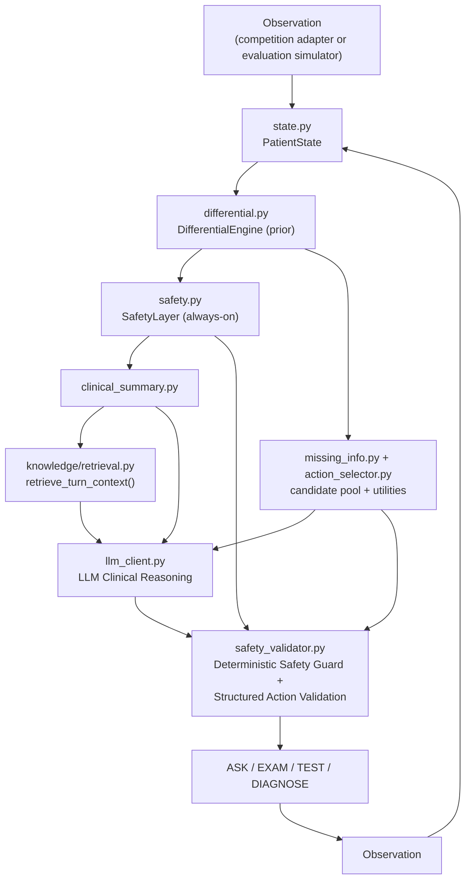

# N.O.V.A. 2026 Doctor Agent

A conversational medical-diagnosis agent (**ASK / EXAM / TEST / DIAGNOSE**) built for the N.O.V.A.
2026 competition as an independent, standalone `nova_agent` module. It reasons iteratively from a
limited initial presentation toward a differential diagnosis, actively guards against missing
time-critical ("can't-miss") conditions, and always submits a final diagnosis within a hard
60-turn limit.

Everything below reflects verified, executed behavior (`pytest tests/`, `evaluation.benchmark`,
`evaluation.ablation`, `evaluation.adversarial`, `scripts/preflight_competition.py`, and a real
standalone subprocess run of `submission/`) -- see [Known Limitations](#8-known-limitations) for
what is *not* yet verified.

**Verification status** (these are three genuinely different claims -- never conflate them):
- **Code / test CI**: READY -- 64 unit tests, the full local benchmark suite (tuning, held-out,
  generalization-v2, stress), adversarial, stability, ablation, and submission-build checks all pass
  under the deterministic `mock` LLM provider, and are enforced in CI (see `.github/workflows/`).
- **Real competition LLM (a live model actually generating turns)**: NOT VERIFIED -- no live call to
  a real model has been observed in this environment (no GPU/API access at implementation time); the
  HTTP client, prompt construction, and parse/repair/fallback path are only unit- and
  subprocess-tested against scripted/mocked responses.
- **Official N.O.V.A. 2026 competition API**: NOT VERIFIED / PLACEHOLDER -- no official interface
  document was published at implementation time, so `competition/schema.py` and
  `competition/adapter.py` are an explicit, disclosed placeholder behind the adapter boundary.

> No official N.O.V.A. 2026 Agent API/interface document was available at implementation time.
> Everything competition-protocol-shaped lives behind `competition/adapter.py` + `schema.py` (an
> explicit adapter pattern), so the real interface can be dropped in without touching the clinical
> reasoning engine -- see [Submission](#7-submission--competition-runtime) below.

## 1. Why an agent, not just a prompt

A single "diagnose this patient" LLM call can't do three things a real triage workflow needs:
guarantee a hard-coded set of critical diagnoses is never silently dropped from consideration,
guarantee a duplicate/hallucinated action is never executed, and guarantee a final diagnosis is
always produced before a turn budget runs out. This repo answers that with a hybrid: **LLM
Clinical Reasoning + Deterministic Safety Guard + Structured Action Validation**, not a
deterministic decision tree that an LLM merely rephrases, and not an LLM given free rein with no
guardrails either.

## 2. Architecture



- The deterministic engine (`differential.py`/`safety.py`/`missing_info.py`/`action_selector.py`)
  always runs first, producing a *prior* differential, safety findings, and a scored, legal
  candidate pool (every non-duplicate legal ASK/EXAM/TEST, not one pre-picked "correct" action).
- `llm_client.py` gets that prior plus RAG-retrieved knowledge and may re-rank the differential,
  add evidence, **introduce a diagnosis outside the local knowledge base**, and select *any* legal
  candidate -- not only the highest-utility one.
- `safety_validator.py` is the **only** place that ever overrides the LLM, for an explicit, short
  list of hard violations (below). Everything else the LLM chooses executes as-is. Proven, not
  just asserted -- see `tests/test_hybrid_and_robustness.py::test_llm_can_change_differential` /
  `test_llm_can_select_valid_non_deterministic_candidate`.

## 3. The ASK / EXAM / TEST / DIAGNOSE loop

Each turn: the deterministic engine proposes a scored candidate pool -> the LLM reasons over it
and picks an action (or introduces a novel one) -> `safety_validator.py` either accepts it or
overrides it. An override happens only for: a DIAGNOSE while a dangerous, unresolved diagnosis
remains (including one the LLM itself introduced -- `resolution.py`); a `key`/`content` mismatch on
DIAGNOSE (e.g. key resolves to GERD, content says "Acute MI"); a duplicate action; an unknown
action key that can't be canonicalized onto the real taxonomy (`action_canonicalizer.py`); an
unrecognized action type; no usable LLM output; or the turn limit. A novel LLM-proposed action
(e.g. "CTA chest") is canonicalized onto the real taxonomy (`ct_chest_angio`) before being rejected
outright -- see [Hybrid candidate expansion](#4-safety--hybrid-candidate-expansion) below.

## 4. Safety & hybrid candidate expansion

`safety.py` raises a `SafetyFinding` from four independent, chief-complaint-tag-gated triggers
(never a blanket check): symptom-keyword overlap against 14 time-critical diagnoses, vital-sign
thresholds (`vitals_parser.describe_vital_sign_abnormalities`), demographic risk (e.g.
reproductive-age female + abdominal pain -> ectopic pregnancy considered), and medication risk
(e.g. anticoagulant + headache -> intracranial hemorrhage risk raised). Any active finding is
guaranteed to stay in the differential even if the LLM's own output dropped it.

A dangerous diagnosis is "resolved" (`resolution.py`) only via explicit contradictory evidence, or
-- for a known diagnosis -- completing its `minimum_workup` (a small rule-in/rule-out subset, e.g.
ACS: ECG + troponin, not also CXR, to avoid unnecessary testing). **A novel/unknown diagnosis the
LLM introduces is never auto-resolved just because there's no knowledge-base entry to check a
workup against** -- the actual bug this fixes: an LLM-flagged `dangerous_if_missed=True` diagnosis
outside the 34-disease catalog used to be silently unblockable. Regression-tested in
`tests/test_safety_regression.py`.

## 5. RAG

`knowledge/retrieval.py`'s `retrieve_turn_context()` assembles, per turn, only what's relevant:
one chief-complaint guideline sentence, a one-line note per dangerous diagnosis in the top-3
differential, and notes for the specific tests under consideration -- never the whole knowledge
base. Feature-flagged (`NOVA_RAG_ENABLED`, default on). Every snippet is honestly labeled
`internally_authored_heuristic` -- see [`knowledge/PROVENANCE.md`](nova_agent/knowledge/PROVENANCE.md):
nothing in this repo cites a fabricated external source.

## 6. Evaluation & results

```bash
pytest tests/ -v                        # 64 tests
python -m evaluation.benchmark --generalization-v2 --stress  # tuning + held-out + generalization-v2 + stress, full metrics
python -m evaluation.benchmark --held-out-only
python -m evaluation.generalization_benchmark
python -m evaluation.ablation           # A (basic) -> F (+retrieval) component contribution
python -m evaluation.adversarial        # crash-resistance / reliability checks
python -m evaluation.stability --runs 5 # run-to-run determinism (agreement/variance)
python -m evaluation.failure_analysis   # automated root-cause classification of held-out misses
python -m evaluation.tune --random 20   # local weight calibration (tuning set only, never held-out)
python -m evaluation.benchmark --generalization-v2 --stress --save-json evaluation/latest_results.json && python scripts/check_readme_numbers.py
```

`evaluation/cases.py` (8 cases) is the *tuning set* current `config.py` defaults were iterated
against. `evaluation/held_out_cases.py` (18 cases) and `evaluation/generalization_cases_v2.py`
(**18 more cases**: elderly polypharmacy, immunocompromised, anticoagulant+antiplatelet
polypharmacy, conflicting findings, vague complaints, rare-but-dangerous, and more benign/dangerous
mimics -- together exercising every one of this repo's 34 knowledge-base diagnoses at least once)
were **never** used to tune any default -- they exist to measure generalization, and are a
moderate, deliberately non-padded expansion (each case is a genuinely distinct scenario, not a
reworded duplicate). `evaluation/generalization_stress_cases.py` (**8 more cases**) is a small,
targeted follow-up set, added after root-causing the two generalization v2 misses described below:
half the cases exercise the fix (atypical/non-diabetic hypoglycemia, migraine with aura in
different wording, stroke presenting as headache) and half are deliberate **negative controls**
checking the fix doesn't overfire (a real stroke that borrows migraine-sounding language, an
elderly new-onset dangerous headache with no migraine history, a polypharmacy weakness case that is
hyperkalemia rather than hypoglycemia, and a weakness case with a *normal* glucose result whose real
cause is a GI bleed). `scripts/check_readme_numbers.py` verifies the table below never silently
goes stale against a fresh `evaluation/latest_results.json`.

| Set | Scored Accuracy | All-Case Accuracy | Critical Recall | Critical Miss Rate | Avg Turns |
|---|---|---|---|---|---|
| Tuning (8 cases) | 100.0% | 100.0% | 100.0% | 0.0% | 14.2 |
| Held-out (18 cases, 15 scored, 13 critical) | 100.0% | 94.4% | 100.0% | 0.0% | 17.1 |
| Generalization v2 (18 cases, all scored, 5 critical) | 100.0% | 100.0% | 100.0% | 0.0% | 15.7 |
| Stress set (8 cases, all scored, 5 critical) | 100.0% | 100.0% | 100.0% | 0.0% | 15.9 |

"Scored" excludes deliberately ambiguous/insufficient-info/unmapped-complaint stress cases (see
`evaluation/benchmark.py`'s exclusion disclosure); "All-Case" is the same correctness check applied
to every case with no exclusions, so a hard case can never be hidden from the headline number. Full
metric definitions and the local (non-official) utility-score proxy live in `evaluation/scoring.py`
and `evaluation/benchmark.py` -- never presented as an official competition score.

Ablation (`python -m evaluation.ablation`):

| Stage | Accuracy | Avg Turns | Critical Miss |
|---|---|---|---|
| A. Basic Agent (fixed checklist) | 37.5% | 7.0 | 66.7% |
| C. + Differential Engine | 100.0% | 7.0 | 0.0% |
| E. + Safety Layer | 100.0% | 11.6 | 0.0% |
| F. + Retrieval | 100.0% | 11.6 | 0.0% |

(F vs. E shows no delta under the default `mock` provider by construction -- retrieval only feeds
the real-LLM prompt, which `mock` never constructs; see `test_rag_context_reaches_llm`.)

## 7. Submission & competition runtime

```
submission/
  run.py               # JSON-lines protocol on stdin/stdout, or --interactive
  requirements.txt      # pydantic only -- no `openai` package dependency (stdlib urllib HTTP client)
  nova_agent/, competition/   # copied from the repo root -- never hand-edited
```

Regenerate after any change to `nova_agent/`/`competition/`: `python scripts/build_nova_submission.py`
(`tests/test_safety_regression.py::test_submission_source_sync` fails CI on drift).

`submission/run.py` defaults `NOVA_LLM_PROVIDER=competition` and runs a startup preflight
(`client.preflight()`) before the first turn: if the real endpoint is unreachable, it prints a
clear diagnostic to stderr and continues on the deterministic per-turn fallback (dev/runtime
fallback policy), rather than silently spending the whole case on `mock`. Before a real run, gate
on `scripts/preflight_competition.py`, which prints `READY`/`NOT READY` and exits non-zero unless a
real provider is configured, reachable, and produces legal structured/action output:

```bash
NOVA_LLM_PROVIDER=competition NOVA_COMPETITION_BASE_URL=http://localhost:8000/v1 \
  python scripts/preflight_competition.py
python scripts/smoke_real_llm.py   # prints SKIPPED_REAL_LLM if no real provider configured
```

`competition/schema.py` is an explicit, disclosed **placeholder** (no official N.O.V.A. 2026 API
was published at implementation time) -- update it and `competition/adapter.py` once the real one
ships; nothing else needs to change, since `nova_agent/`, `evaluation/`, `submission/`, and
`tests/` only ever depend on `PatientState`/`AgentAction`.

## 8. Known Limitations

- **Knowledge base breadth**: 34 diagnoses across 15 chief-complaint tags -- far from exhaustive;
  the LLM can introduce diagnoses outside this set, but the deterministic prior only covers these.
- **Generalization v2 was 88.9%, with two real misses, as of the previous round** -- both were
  root-caused (not patched around the specific case text) and are now fixed, verified at 100.0% on
  the existing held-out and generalization-v2 sets plus a new 8-case stress set (see the table
  above), with no critical miss, no accuracy regression, and no increase in duplicate/malformed
  output anywhere:
  - *Elderly polypharmacy hypoglycemia* (`Weakness01_ElderlyPolypharmacyHypoglycemia`) was losing to
    diabetic ketoacidosis because of two literally-garbled `confirmatory_findings` entries in the
    knowledge base (`"blood glucose 4"` / `"blood glucose 3"`) that matched almost any glucose
    result via keyword overlap regardless of the actual number -- removed, and replaced with a
    principled numeric glucose reader (`nova_agent/glucose_evidence.py`) using the standard clinical
    thresholds (ADA hypoglycemia <70 mg/dL; DKA-range hyperglycemia >=250 mg/dL, never fitted to a
    benchmark case's specific value), plus a small, explicitly-scoped medication-class alias table
    (glipizide/glyburide/insulin -> the KB's existing `"sulfonylurea use"`/`"insulin use"` risk
    factors) and a matching `hypoglycemia`-targeting entry in the existing `medication_risk_rules`
    infrastructure.
  - *Migraine vs. ischemic stroke* (`Headache04_ReassuringMigraine`) was a 0.0-vs-0.0 score tie
    resolved by disease-declaration order, because migraine's own typical features never matched lay
    phrasing ("throbbing" vs. the KB's "pulsating", "sensitive to light" vs. "photophobia") and an
    objective negative exam finding ("no focal neurological deficit") had no mechanism to lower
    stroke's score at all. Fixed with (a) a small **feature-local** alias table
    (`FEATURE_ALIASES` in `nova_agent/differential.py`) -- each alias is attached to and only ever
    used for the ONE exact knowledge-base phrase it's keyed to, never a global text substitution
    (the earlier `clinical_synonyms.py` global-synonym attempt caused broad cross-disease
    regressions and was reverted; this is a deliberately narrower design learning from that), and
    (b) a new opt-in `reassuring_if_present` per-disease field that lets an objective negative exam
    finding apply a bounded, soft penalty (never a hard exclusion) to a specific dangerous
    diagnosis.
  - The held-out `unnecessary_test_rate` metric was also investigated (spec-requested): about half
    of the previously-reported "unnecessary" tests were a metric-definition artifact -- rule-out
    tests for a plausible, evidence-driven alternative that simply wasn't in the metric's
    dangerous-diagnoses-only allowlist (e.g. ruling out a urinary source of an elderly patient's
    altered mental status). `evaluation/simulator.py::_relevant_test_ids` now also credits any
    diagnosis the agent's own differential engine actually ranked at #1 or #2 at some point during
    the case, not only diagnoses flagged `dangerous: true` in the knowledge base.
  - As with the earlier reverted attempt, every one of these fixes is scoped and disease/phrase-
    level, not a blanket rule -- see `nova_agent/differential.py`'s `FEATURE_ALIASES` docstring for
    the full list of what's covered and what deliberately isn't.
- **No live real-LLM call observed in this environment** (no GPU/API keys available at
  implementation time) -- the HTTP integration, prompt construction, and parse/repair/fallback path
  are unit- and subprocess-tested with scripted/mocked clients and a local HTTP test server, not
  exercised against a live gpt-oss-20b or Claude response end-to-end.
- **Matching is keyword/entropy-based, not an embedding model** (`matching.py`) -- deliberate, for
  determinism and testability, but misses synonym pairs neither stemmed nor keyword-matched (e.g.
  "hypoxia" vs. "hypoxemia" currently do not cross-match).
- **`evaluation.tune`'s search space is small** (3 weights) and only optimizes against the tuning
  set; a starting point for manual calibration, not an automated tuner.
- **Latency / LLM-calls-per-case / token usage** are measured ad hoc by `scripts/smoke_real_llm.py`
  against a single turn, not systematically across the full evaluation harness.

## 9. Installation

```bash
python3 -m venv .venv && source .venv/bin/activate
pip install -r requirements-nova.txt       # runtime only: pydantic
pip install -r requirements-nova-dev.txt   # + pytest, for the test suite
```

`nova_agent` has no required dependency on the vendored SynexAgent backend at all
(`tests/test_hybrid_and_robustness.py::test_standalone_without_backend`).

```python
from nova_agent.orchestrator import DoctorAgent

agent = DoctorAgent()  # NOVA_LLM_PROVIDER=mock by default: fully offline, deterministic
state = agent.new_case("case1", "chest pain", demographics={"age": 58, "sex": "male"})
while True:
    action, llm_output, differential = agent.decide(state)
    print(action.action_type, action.content)
    if action.action_type == "DIAGNOSE":
        break
    agent.observe(state, action, input("> "))
```

## 10. Directory structure

```
nova_agent/       Independent, standalone clinical reasoning engine (no backend/UI dependency)
competition/      Competition integration (adapter pattern; the only files an official API changes)
evaluation/       Local benchmark harness: tuning + held-out cases, simulator, benchmark,
                  ablation, adversarial, tune, scoring (all synthetic vignettes, never real patient data)
submission/       Standalone, backend-independent deployable package (run.py entrypoint)
scripts/          build_nova_submission.py, preflight_competition.py, smoke_real_llm.py
tests/            pytest suite (64 tests)
```

Module-by-module responsibility and full LLM-provider config are documented in
[`nova_agent/`'s inline docstrings](nova_agent/orchestrator.py) (each module's header explains its
spec section and role) and [`nova_agent/config.py`](nova_agent/config.py) (every tunable
weight/threshold, all overridable by environment variable).

## 11. Origin / Previous Work

This repository also contains **SynexAgent** (`backend/`, `frontend/`, `docs/`, ...), an existing
medical decision-support system (medication risk/interaction checking, EMR/FHIR clinical
workspace) this competition agent was built alongside and reuses a small amount of standalone-safe
code from (audit logging, terminology mapping) via an optional, degrades-to-no-op adapter
(`nova_agent/_synex.py`) -- never a hard dependency. SynexAgent's own documentation is
[README_SYNEXAGENT.md](README_SYNEXAGENT.md); its own 267-test suite is unaffected by this agent
and still passes as-is (`pytest backend/tests`). The Doctor Agent above is fully independent of
SynexAgent's React/Vite UI and FastAPI server -- it never needs them running.

## 12. Troubleshooting

- **`python -m evaluation.*` import errors**: run as modules from the repo root
  (`python -m evaluation.benchmark`, not `python evaluation/benchmark.py`).
- **A real LLM provider silently falls back to deterministic output per turn**: by design on any
  network/parsing failure (`nova_agent/llm_client.py`) -- check the `nova_agent.llm` logger. For a
  competition run, gate on `scripts/preflight_competition.py` first so this can't happen unnoticed
  for an entire case.
- **`submission/` is stale after editing `nova_agent/`**: run `python scripts/build_nova_submission.py`.
- **Backend (SynexAgent) tests fail after modifying `nova_agent/`**: they shouldn't -- `backend/`
  never imports from `nova_agent/`/`competition/` (only the optional reverse). Run
  `pytest backend/tests` in isolation to confirm.
