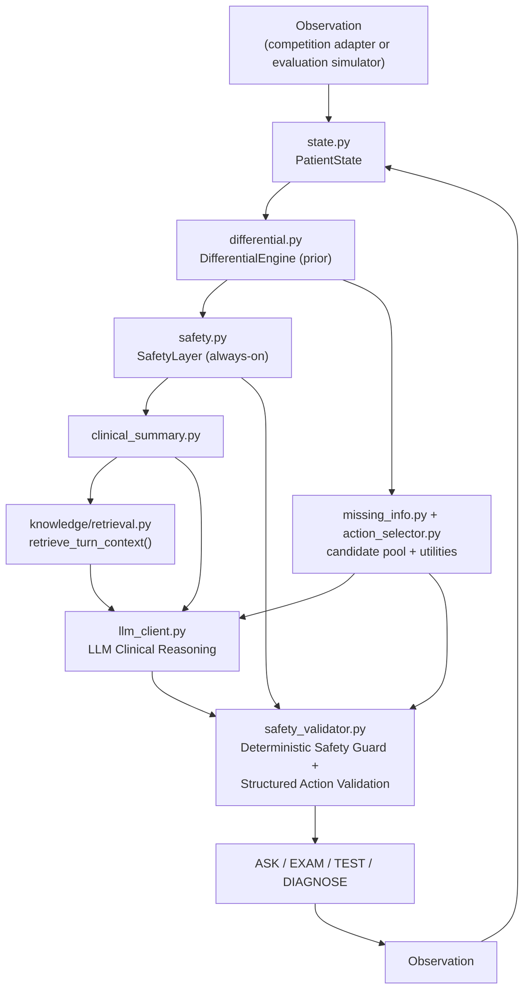

# N.O.V.A. 2026 Doctor Agent

A conversational medical-diagnosis agent (**ASK / EXAM / TEST / DIAGNOSE**) built for the N.O.V.A.
2026 competition as an independent, standalone `nova_agent` module. It reasons iteratively from a
limited initial presentation toward a differential diagnosis, actively guards against missing
time-critical ("can't-miss") conditions, and always submits a final diagnosis within a hard
60-turn limit.

Everything below reflects verified, executed behavior (`pytest tests/`, `evaluation.benchmark`,
`evaluation.ablation`, `evaluation.adversarial`, `scripts/preflight_competition.py`, and a real
standalone subprocess run of `submission/`) -- see [Known Limitations](#8-known-limitations) for
what is *not* yet verified.

**Verification status** (these are three genuinely different claims -- never conflate them):
- **Code / test CI**: READY -- 233 unit tests, the full local benchmark suite (tuning, held-out,
  generalization-v2, stress), adversarial, stability, ablation, and submission-build checks all pass
  under the deterministic `mock` LLM provider, and are enforced in CI (see `.github/workflows/`).
- **Real competition LLM (a live model actually generating turns)**: NOT VERIFIED -- no live call to
  a real model has been observed in this environment (no GPU/API access at implementation time); the
  HTTP client, prompt construction, and parse/repair/fallback path are only unit- and
  subprocess-tested against scripted/mocked responses.
- **Official N.O.V.A. 2026 competition API**: NOT VERIFIED / PLACEHOLDER -- no official interface
  document was published at implementation time, so `competition/schema.py` and
  `competition/adapter.py` are an explicit, disclosed placeholder behind the adapter boundary.

> No official N.O.V.A. 2026 Agent API/interface document was available at implementation time.
> Everything competition-protocol-shaped lives behind `competition/adapter.py` + `schema.py` (an
> explicit adapter pattern), so the real interface can be dropped in without touching the clinical
> reasoning engine -- see [Submission](#7-submission--competition-runtime) below.

## Validation readiness — 2026-10-02 (Asia/Seoul)

The latest revision adds external frozen-case loading, real-model workflow support, bounded
Korean/English normalization, offline catalog extensions, uncertainty reporting, and repeat-question
suppression. It does **not** complete independent clinical validation or probability calibration.
Full setup and the six remaining boundaries are in [Validation readiness](docs/VALIDATION_READINESS.md).

- External case JSON/manifest contents are checked before use; missing responses stay unknown.
  Authorship and clinical review are declarations, never inferred from a file hash.
- The real-model runner accepts these frozen cases, records case/catalog hashes for resume,
  requires a successful real response for every decision with `--require-real` (no fallback or
  budget-skipped decisions), and reports reliability by qualitative evidence band.
  A manual GitHub workflow is available but has not been dispatched with a live model here.
- Original Korean observations are preserved while explicit phrases, negation, abbreviations
  and vital labels get bounded normalization. Family observations do not become patient symptoms.
- `NOVA_KNOWLEDGE_EXTENSION` accepts validated offline definitions; overrides and invented test
  keys are rejected. The built-in catalog remains 34 diseases. Outside-catalog and companion
  diagnoses now have explicit evaluation/reporting fields; no broad coverage claim is made.
- Unsupported/novel, conflicting, tied or forced decisions are flagged LOW with reasons;
  probability is null and calibration false. Forcing a final answer no longer implies readiness 1.
- Existing medication text and associated symptoms suppress repeat questions. A broader pruning
  experiment reduced V5 to 42/44 and was rejected; it is not enabled or shipped as an option.

208 tests pass. Local mock regressions retain V3 32/32, V4 34/34, V5 44/44, existing scored
49/49 and reused V6 12/12. The example external loader executes under mock and correctly reports
real verification false. Preflight remains NOT READY without a live endpoint. Full results,
confidence buckets and the rejected experiment are in `evaluation/readiness_results.json`.
The reports below are historical; all 100% figures are development/mock results.

## Assertion handling — 2026-10-02 (Asia/Seoul)

This latest revision reduces false supporting evidence. On 22 newly authored, same-author
adversarial **evidence-interpretation probes**, correct handling improved from **10/22 to 22/22**.
This metric is not diagnostic accuracy. Positive controls verify that genuine reported findings
still contribute support; rejecting every observation would fail the challenge.

- Tentative, hypothetical, inconclusive and contaminated wording is kept in the patient history
  and LLM summary but filtered from deterministic affirmative keyword/confirmatory matching.
- Negated CSF white-cell elevation no longer becomes an affirmative pleocytosis label.
- A ketone result reported only as positive is no longer promoted to large ketones.
- Double negation such as no absent breath sounds does not count as absent breath sounds.
- Temporal evidence spanning clauses remains linked; observed positional triggers and the month
  May are not discarded merely because they contain conditional/modal-looking words.

The interpretation remains a bounded English heuristic. It does not establish clinical
sensitivity/specificity, solve every uncertainty or negation pattern, or supply independent
validation. The following development diagnostic scores must not be presented as live accuracy.

195 tests pass. Full-case diagnostic regressions retain V3 32/32, V4 34/34, V5 44/44,
V6 12/12 and the existing 49/49 scored development cases. All use mock; none establish
independent or live-model accuracy. Adversarial checks and deterministic stability also pass.

Reproducible probe command:

```bash
python -m evaluation.evidence_challenge --save-json evidence-report.json
```

See `evaluation/assertion_validation_results.json` for before/after probe results and current
full-case regressions. Previous reports below remain historical. Live model accuracy remains
unverified because no competition endpoint/key is configured.

## Evidence refinement — 2026-10-02 (Asia/Seoul)

Latest executed **mock** results supersede the historical sections below. This revision fixes
case-sensitive acronym labels hiding asthma history, migration evidence split across clauses,
resolved nasal symptoms counted as present, and infection-compatible specimen results combined
with recorded hypotension and mental-status change. The last pattern is bounded, uncalibrated
support, not a SOFA score, confirmed sepsis diagnosis or a rule-out protocol.

| Suite | Correct | Accuracy | Interpretation |
|---|---:|---:|---|
| V3 | 32/32 | 100.0% | Development; previous two errors used for fixes |
| V4 | 34/34 | 100.0% | Development; previous bronchitis error used for fixes |
| V5 | 44/44 | 100.0% | Development; previous appendicitis error used for fixes |
| Existing scored development | 49/49 | 100.0% | Regression data; three other cases remain explicitly unscored |
| V6 | 12/12 | 100.0% | Reused same-author synthetic validation |

Critical-case recall is 100% in these local suites. V3/V4/V5 together have 110 cases;
none of their original case text, labels or freeze manifests changed. The development
accuracy is not an independent generalization claim or live clinical/model accuracy.
All cases, costs, exclusions, and limits are recorded in `evaluation/accuracy_refinement_results.json`.
Earlier reports are retained. Mean turns remain high: V3 30.9, V4 29.0, V5 29.6.

172 tests pass, including failures for tentative cultures, isolated shock without infection,
negated mental change, resolved symptoms and non-migratory location descriptions. Submission
build/standalone smoke, source-sync, adversarial/stability, and README/leakage checks are executed.
For formatting robustness, `evaluation.text_robustness` changes only capitalization and comma
punctuation on the same development observations: all 110/110 formatting variants remain
correct (V3 32/32, V4 34/34, V5 44/44). This is not new independent case evidence.

```bash
python -m evaluation.text_robustness --save-json formatting-report.json
```

Live competition accuracy remains **NOT VERIFIED** because no model endpoint/key is configured.
The official protocol adapter remains unverified. Do not advertise the local 100% as a real
competition or patient-population accuracy. See the existing live-verification commands below.

## Accuracy follow-up — 2026-10-01

**Local synthetic development accuracy now exceeds 90% in each reported scored suite.**
This is not independent generalization or live competition-model verification. V3/V4/V5
errors were analyzed during development; V6 is a reused, small same-author synthetic set.
All runs use `mock`. The prior accuracy revision below is historical.

| Evaluation | Correct | Accuracy | Status |
|---|---:|---:|---|
| V3 | 30/32 | 93.8% | Development, reused historical cases |
| V4 | 33/34 | 97.1% | Development after follow-up error analysis |
| V5 | 43/44 | 97.7% | Development; one appendicitis remains wrong |
| Existing scored development | 49/49 | 100.0% | Includes recovery of the appendicitis regression |
| V6 | 12/12 | 100.0% | Reused same-author synthetic validation |

The held-out-named historical suite has three unscored cases; its scored denominator is 15,
not 18. All-case accuracy and exclusion names remain visible in the detailed report.

The follow-up fixes anatomical and event anchors (a pounding heart cannot imply headache;
sudden abdominal pain cannot imply dyspnea), recognizes named lipase results, appendix CT
findings, explicit pathological absence of breath sounds, tracheal shift and wheeze inflection,
and ensures abdominal complaints receive a baseline abdominal exam. Nonspecific inflammatory
markers receive less weight than disease-specific evidence. Sources and heuristic limitations
are documented in `nova_agent/knowledge/PROVENANCE.md`; this is not complete clinical criteria.

There are remaining errors, including urosepsis on V3. V5 decreased from 44/44 to 43/44
while V4 improved from 29/34 to 33/34 and generalization-v2 recovered from 17/18 to 18/18.
These tradeoffs are retained rather than selecting only favorable evaluations. Mean turns:
V3 30.8, V4 29.0, V5 29.6; efficiency is not solved.

167 tests, 12 adversarial checks, stability, submission standalone build/source sync, and
README/evaluation-leakage checks pass locally. Full results and remaining misses are in
`evaluation/accuracy_followup_results.json`; the earlier report is retained unchanged.
Competition preflight is **NOT READY** because no real model is configured and the official
adapter remains unverified. A successful live model call is still enforced before submission.

To perform live complete-case verification, configure the approved competition model endpoint
and credentials in environment variables/GitHub secrets, then run:

```bash
python scripts/preflight_competition.py
python -m evaluation.real_llm_benchmark --provider competition --require-real --timeout 180 --save-json real-llm-report.json
```

Do not claim live or independent 90% accuracy from the local development table above.

## Accuracy revision — 2026-10-01

**The 90% generalization target is not established.** All results below use the deterministic
`mock` provider, not the competition LLM. These results supersede the earlier review below.

| Evaluation | Correct | Accuracy | Interpretation |
|---|---:|---:|---|
| V5 development | 44/44 | 100.0% | Used to diagnose failures and implement fixes; not blind |
| V4 reused reference | 29/34 | 85.3% | Not tuned in this revision; below the target |
| V6 new synthetic validation | 12/12 | 100.0% | Same author, frozen before first run; small and not externally adjudicated |
| Existing scored development cases | 48/49 | 98.0% | Regression data; generalization-v2 appendicitis now misses |

V5 critical-case recall is 20/20, V4 is 13/14, and V6 is 6/6. Do not pool these
sets to hide the V4 shortfall or present development accuracy as real clinical accuracy.
V5 average turns increased from 25.1 to 29.7; test efficiency remains a limitation.

Implemented changes:
- Send history, medications, allergies, symptom timing, and supporting/contradicting evidence
  to the LLM; preserve unknown and explicitly denied facts.
- Re-score the complete 34-diagnosis catalog every turn, allowing candidates outside the
  initial complaint route to enter when evidence appears.
- Interpret scoped clinical synonyms and procedure-specific objective findings; prevent CSF
  findings from becoming urinary/blood evidence. Replace six-character token truncation,
  enforce anatomical anchors, and interpret posture-bound numeric blood-pressure changes.
- Gather missing vital signs, onset, associated symptoms, medical history and medications
  alongside disease-discriminating workup before an early diagnosis.
- Add a final evidence-review checklist and the valid action catalog to the existing LLM
  request. This introduces no extra LLM call; its accuracy effect is unverified under mock.

V5 leave-one-feature-out accuracy: full 100.0%; without broad candidates 93.2%; without
new evidence interpretation 65.9%; without strategic questions 97.7%; without final-review
prompt 100.0% (expected under mock). These are feature comparisons within the new code,
not a recreation of the original baseline. Full case results, failures, and limitations are
recorded in `evaluation/accuracy_results.json`.

```bash
python -m evaluation.accuracy_experiments --suite v5 --ablate --save-json v5-report.json
python -m evaluation.accuracy_experiments --suite v4 --save-json v4-report.json
python -m evaluation.accuracy_experiments --suite v6 --save-json v6-report.json
```

The V6 runner verifies its frozen file hash. Runtime code never imports evaluation cases.
Live competition-model evaluation and an independently authored, sufficiently large held-out
set are still needed to establish the requested target. Official API compatibility remains
unverified. The following review records the previous revision, not current accuracy.

## Review revision — 2026-10-01

This section supersedes the historical implementation notes below. The four development
benchmark rows in section 6 are current; the original Blind v3/v4/v5 rows are historical.

- Chief-complaint routing now removes denied clauses, preserves multiple affirmed concepts,
  expands neurologic/pelvic/GI-bleeding coverage, and accepts up to three validated optional
  `complaint_tags` from the LLM to expand low-confidence candidate pools on the next turn.
- Dangerous alternatives are no longer discharged by an ungrounded LLM contradiction or
  a positive/pending/empty result marked "completed". Resolution requires recorded,
  diagnosis-specific exclusion or explicit normal/negative minimum-workup observations.
  This remains a conservative synthetic-evaluation heuristic, not a clinical rule-out protocol.
- A blocked diagnosis now selects a remaining nonduplicate evidence action instead of
  returning the same blocked diagnosis. Zero-information-gain cannot bypass unresolved danger.
- Candidate utilities prioritize missing minimum-workup actions for supported dangerous
  candidates; safety-flagged diagnoses can contribute actions even outside the top five.
  **Efficiency is not solved:** the stricter evidence gate increases average turns versus the
  old implementation. Do not claim fewer tests or faster diagnosis from these changes.
- Numeric BMP potassium contributes disease-specific evidence, with unsupported units,
  ranges and unreliable samples rejected. The threshold source is documented in
  `nova_agent/electrolyte_evidence.py`; the parser is deliberately limited.
- Test relevance uses a fixed knowledge-base/case-authored allowlist, never the agent's own
  ranking history. Both benchmark runners share it. Old unnecessary-test scores are not
  comparable to the new metric (`independent_allowlist_v2`).
- Full-case real-model validation supports `--require-real`, tracks JSON parse failures,
  call successes, fallback, latency and reported tokens, and rejects incompatible resumed runs.
  A competition diagnosis requires `real_llm_ever_succeeded is True`, including when zero
  calls were attempted. Configured CI now runs three complete real-model cases.

```bash
python -m evaluation.real_llm_benchmark --provider competition --require-real --timeout 180 --save-json real-llm-report.json
```

**Live model and official adapter remain NOT VERIFIED** in this workspace: no endpoint/key was
configured and the official protocol adapter is still a placeholder. No live-model accuracy is
claimed. Model-provided symptom tags and actual inference latency still need live validation.
The 52 development cases are regression data, not an untouched generalization claim.

Post-change re-evaluation of the existing Blind v5 set: **25/44 correct (56.8%)**, **10/20
critical cases correct (50.0%)**, average **25.1 turns**. Previous recorded values were 52.3%,
40.0%, and 20.7 turns. V5 is now a reused reference set, **not a new untouched holdout**;
its aggregate analysis informed this review. No v5 case text or expected label was edited.
Remaining misses are substantial. The safety/efficiency tradeoff remains open; this is not
competition-readiness or clinical-validation evidence. See `evaluation/review_validation.json`.

## 1. Why an agent, not just a prompt

A single "diagnose this patient" LLM call can't do three things a real triage workflow needs:
guarantee a hard-coded set of critical diagnoses is never silently dropped from consideration,
guarantee a duplicate/hallucinated action is never executed, and guarantee a final diagnosis is
always produced before a turn budget runs out. This repo answers that with a hybrid: **LLM
Clinical Reasoning + Deterministic Safety Guard + Structured Action Validation**, not a
deterministic decision tree that an LLM merely rephrases, and not an LLM given free rein with no
guardrails either.

## 2. Architecture


```mermaid
flowchart TD
  OBS["Observation\n(competition adapter or evaluation simulator)"] --> STATE
  STATE["state.py\nPatientState"] --> DIFF["differential.py\nDifferentialEngine (prior)"]
  DIFF --> SAFETY["safety.py\nSafetyLayer (always-on)"]
  SAFETY --> SUMMARY["clinical_summary.py"]
  SUMMARY --> RAG["knowledge/retrieval.py\nretrieve_turn_context()"]
  DIFF --> CAND["missing_info.py + action_selector.py\ncandidate pool + utilities"]
  RAG --> LLM
  SUMMARY --> LLM["llm_client.py\nLLM Clinical Reasoning"]
  CAND --> LLM
  LLM --> GUARD["safety_validator.py\nDeterministic Safety Guard +\nStructured Action Validation"]
  SAFETY --> GUARD
  CAND --> GUARD
  GUARD --> ACTION["ASK / EXAM / TEST / DIAGNOSE"]
  ACTION --> OBS2["Observation"] --> STATE
```

- The deterministic engine (`differential.py`/`safety.py`/`missing_info.py`/`action_selector.py`)
  always runs first, producing a *prior* differential, safety findings, and a scored, legal
  candidate pool (every non-duplicate legal ASK/EXAM/TEST, not one pre-picked "correct" action).
- `llm_client.py` gets that prior plus RAG-retrieved knowledge and may re-rank the differential,
  add evidence, **introduce a diagnosis outside the local knowledge base**, and select *any* legal
  candidate -- not only the highest-utility one.
- `safety_validator.py` is the **only** place that ever overrides the LLM, for an explicit, short
  list of hard violations (below). Everything else the LLM chooses executes as-is. Proven, not
  just asserted -- see `tests/test_hybrid_and_robustness.py::test_llm_can_change_differential` /
  `test_llm_can_select_valid_non_deterministic_candidate`.

## 3. The ASK / EXAM / TEST / DIAGNOSE loop

Each turn: the deterministic engine proposes a scored candidate pool -> the LLM reasons over it
and picks an action (or introduces a novel one) -> `safety_validator.py` either accepts it or
overrides it. An override happens only for: a DIAGNOSE while a dangerous, unresolved diagnosis
remains (including one the LLM itself introduced -- `resolution.py`); a `key`/`content` mismatch on
DIAGNOSE (e.g. key resolves to GERD, content says "Acute MI"); a duplicate action; an unknown
action key that can't be canonicalized onto the real taxonomy (`action_canonicalizer.py`); an
unrecognized action type; no usable LLM output; or the turn limit. A novel LLM-proposed action
(e.g. "CTA chest") is canonicalized onto the real taxonomy (`ct_chest_angio`) before being rejected
outright -- see [Hybrid candidate expansion](#4-safety--hybrid-candidate-expansion) below.

## 4. Safety & hybrid candidate expansion

`safety.py` raises a `SafetyFinding` from four independent, chief-complaint-tag-gated triggers
(never a blanket check): symptom-keyword overlap against 14 time-critical diagnoses, vital-sign
thresholds (`vitals_parser.describe_vital_sign_abnormalities`), demographic risk (e.g.
reproductive-age female + abdominal pain -> ectopic pregnancy considered), and medication risk
(e.g. anticoagulant + headache -> intracranial hemorrhage risk raised). Any active finding is
guaranteed to stay in the differential even if the LLM's own output dropped it.

A dangerous diagnosis is "resolved" (`resolution.py`) only via explicit contradictory evidence, or
-- for a known diagnosis -- completing its `minimum_workup` (a small rule-in/rule-out subset, e.g.
ACS: ECG + troponin, not also CXR, to avoid unnecessary testing). **A novel/unknown diagnosis the
LLM introduces is never auto-resolved just because there's no knowledge-base entry to check a
workup against** -- the actual bug this fixes: an LLM-flagged `dangerous_if_missed=True` diagnosis
outside the 34-disease catalog used to be silently unblockable. Regression-tested in
`tests/test_safety_regression.py`.

## 5. RAG

`knowledge/retrieval.py`'s `retrieve_turn_context()` assembles, per turn, only what's relevant:
one chief-complaint guideline sentence, a one-line note per dangerous diagnosis in the top-3
differential, and notes for the specific tests under consideration -- never the whole knowledge
base. Feature-flagged (`NOVA_RAG_ENABLED`, default on). Every snippet is honestly labeled
`internally_authored_heuristic` -- see [`knowledge/PROVENANCE.md`](nova_agent/knowledge/PROVENANCE.md):
nothing in this repo cites a fabricated external source.

## 6. Evaluation & results

```bash
pytest tests/ -v                        # 151 tests
python -m evaluation.benchmark --generalization-v2 --stress  # tuning + held-out + generalization-v2 + stress, full metrics
python -m evaluation.benchmark --held-out-only
python -m evaluation.generalization_benchmark
python -m evaluation.ablation           # A (basic) -> F (+retrieval) component contribution
python -m evaluation.adversarial        # crash-resistance / reliability checks
python -m evaluation.stability --runs 5 # run-to-run determinism (agreement/variance)
python -m evaluation.failure_analysis   # automated root-cause classification of held-out misses
python -m evaluation.tune --random 20   # local weight calibration (tuning set only, never held-out)
python -m evaluation.blind_benchmark    # blind_cases_v3.py -- reference only, see terminology below
python -m evaluation.blind_benchmark_v4 # blind_cases_v4.py -- reference only, see terminology below
python -m evaluation.blind_benchmark_v5 # blind_cases_v5.py -- the untouched final check, see below
python scripts/check_eval_leakage.py    # best-effort static scan for blind-set leakage into agent core
python -m evaluation.benchmark --generalization-v2 --stress --save-json evaluation/latest_results.json && python scripts/check_readme_numbers.py
```

**Evaluation set terminology** (each name below is used consistently everywhere else in this file):

| Name | File | Role |
|---|---|---|
| **Tuning** | `evaluation/cases.py` (8) | What `config.py`'s defaults were iterated against. |
| **Held-out regression** | `evaluation/held_out_cases.py` (18) | Never used to tune a default or drive a fix -- a genuinely blind regression check on every run. |
| **Development generalization** | `evaluation/generalization_cases_v2.py` (18) | Not used for the *initial* tuning pass, but two of its failures *were* later analyzed and used to drive real fixes (see below) -- read its 100% as "generalization-informed, fix-verified," not untouched. |
| **Targeted stress** | `evaluation/generalization_stress_cases.py` (8) | A small follow-up set deliberately built to probe the exact fix patterns above, plus negative controls that they don't overfire. |
| **Blind v3 reference** | `evaluation/blind_cases_v3.py` (32) | A first blind check, run once and reported as-is. No longer used for tuning as of this round -- kept only as a failure-analysis reference (see [Known Limitations](#8-known-limitations)). |
| **Blind v4 reference** | `evaluation/blind_cases_v4.py` (34, one per knowledge-base diagnosis) | A second blind check, authored and run once after the first structural fix round (routing rewrite + a since-reverted severity-scoring design -- see below). Same reference-only status as Blind v3, not tuned against in this round either. |
| **Untouched Blind v5** | `evaluation/blind_cases_v5.py` (44) + `evaluation/blind_benchmark_v5.py` + `evaluation/blind_v5_manifest.json` | **This round's actual untouched final check.** Authored and hash-frozen (`blind_v5_manifest.json`) only after every structural change below was complete and re-verified against the sets above, then run exactly once. Nothing in `nova_agent/` or this case file was touched in response to its result. |

`evaluation/generalization_cases_v2.py` (**18 more cases**: elderly polypharmacy,
immunocompromised, anticoagulant+antiplatelet polypharmacy, conflicting findings, vague complaints,
rare-but-dangerous, and more benign/dangerous mimics -- together exercising every one of this
repo's 34 knowledge-base diagnoses at least once) is **not the same kind of blind check**: it was
never used for the *initial* `config.py` tuning, but two of its cases' failures (a hypoglycemia
miss and a migraine-vs-stroke miss) were later analyzed and used to drive real code fixes
(`nova_agent/glucose_evidence.py`, `FEATURE_ALIASES`, `reassuring_if_present` in
`nova_agent/differential.py`) -- so its current 100.0% should be read as "generalization-informed,
fix-verified", not as a fully untouched holdout the way `held_out_cases.py` is. This is a moderate,
deliberately non-padded expansion (each case is a genuinely distinct scenario, not a reworded
duplicate), not a source of inflated headline numbers.

`evaluation/cases.py` (8 cases) is the *tuning set* current `config.py` defaults were iterated
against. `evaluation/held_out_cases.py` (18 cases) has **never** been used to tune a default or to
drive any code fix -- it exists purely as an independent regression check, and every result on it
reported anywhere in this README is a genuinely blind score.

`evaluation/generalization_stress_cases.py` (**8 more cases**) is a small,
targeted follow-up set, added after root-causing the two generalization v2 misses described below:
half the cases exercise the fix (atypical/non-diabetic hypoglycemia, migraine with aura in
different wording, stroke presenting as headache) and half are deliberate **negative controls**
checking the fix doesn't overfire (a real stroke that borrows migraine-sounding language, an
elderly new-onset dangerous headache with no migraine history, a polypharmacy weakness case that is
hyperkalemia rather than hypoglycemia, and a weakness case with a *normal* glucose result whose real
cause is a GI bleed). `scripts/check_readme_numbers.py` verifies the table below never silently
goes stale against a fresh `evaluation/latest_results.json`.

| Set | Scored Accuracy | All-Case Accuracy | Critical Recall | Critical Miss Rate | Avg Turns |
|---|---|---|---|---|---|
| Tuning (8 cases) | 100.0% | 100.0% | 100.0% | 0.0% | 27.8 |
| Held-out (18 cases, 15 scored, 13 critical) | 100.0% | 94.4% | 100.0% | 0.0% | 31.2 |
| Development generalization (18 cases, all scored, 5 critical) | 100.0% | 100.0% | 100.0% | 0.0% | 27.6 |
| Targeted stress (8 cases, all scored, 5 critical) | 100.0% | 100.0% | 100.0% | 0.0% | 31.0 |
| Blind v3 reference (32 cases, all scored, 14 critical) | 62.5% | 62.5% | 57.1% | 42.9% | 20.9 |
| Blind v4 reference (34 cases, all scored, 14 critical) | 64.7% | 64.7% | 71.4% | 28.6% | 19.8 |
| **Untouched Blind v5 (44 cases, all scored, 20 critical)** | **52.3%** | **52.3%** | **40.0%** | **60.0%** | 20.7 |

"Scored" excludes deliberately ambiguous/insufficient-info/unmapped-complaint stress cases (see
`evaluation/benchmark.py`'s exclusion disclosure); "All-Case" is the same correctness check applied
to every case with no exclusions, so a hard case can never be hidden from the headline number. Full
metric definitions and the local (non-official) utility-score proxy live in `evaluation/scoring.py`
and `evaluation/benchmark.py` -- never presented as an official competition score. Blind v3/v4/v5
are not wired into `--save-json`/`check_readme_numbers.py` (their numbers above are transcribed by
hand from each run's own output) precisely because they must never become a silent tuning target.

**This round's actual honest number is Untouched Blind v5 (52.3% / 40.0% critical recall / 60.0%
critical miss), not Blind v3/v4.** Blind v3 and v4 are now explicitly **reference-only**: this
round's structural rewrite (chief-complaint confidence routing, a strict diagnostic-score /
severity-score separation, `safety_priority`-driven triage in `stop_policy.py` -- see
[Architecture](#2-architecture) and the changelog below) was deliberately designed and re-verified
against held-out/development-generalization/targeted-stress *without* looking at Blind v3/v4's
specific miss patterns, and neither file was edited. Blind v3's own accuracy moved slightly
(65.6% -> 62.5%) purely as a side effect of that structural work, not because anyone tuned toward
or away from it. Blind v5 was authored fresh only after the rewrite was complete and frozen
(`evaluation/blind_v5_manifest.json` records its SHA-256 before it was ever run), and its result is
reported exactly as first measured.

**Blind v5's lower score than v3/v4 is expected, not a regression** -- it is a harder, broader set
by design (one case per all 34 knowledge-base diagnoses *plus* ten cases explicitly targeting
multimorbidity/polypharmacy/conflicting-evidence/sparse-information/objective-lab-confirmed
presentations as their own axis), and per this round's explicit instruction it was **not** used to
drive any further code or case change. A read-only failure-category pass (no code touched) on its
12 critical misses found:
  - **Routing gaps, not reasoning failures, in most cases**: 11 of 12 critical misses had
    `chief_complaint.route()` return `match_type="none"` (no concept matched at all, correctly
    falling through to the untargeted whole-catalog safety net rather than a wrong confident
    route) -- but several of these are real, generalizable coverage gaps in the 14-concept
    chief-complaint taxonomy itself: "short of breath" (vs. the covered "shortness of breath") is
    missing as its own alias; there is no concept at all for aphasia/word-finding-difficulty stroke
    presentations, pelvic/gynecologic pain, GI-bleeding-specific language ("dark stools", "maroon
    stools" not tied to abdominal_pain), or trauma-mechanism chest complaints. This is legitimate
    future work: expanding `chief_complaint.py`'s alias coverage and possibly adding new concept
    categories, informed by this failure analysis but not by copying any Blind v5 sentence into an
    alias (that would be exactly the leakage `scripts/check_eval_leakage.py` exists to catch).
  - **Ranking/action-selection failures once the whole-catalog fallback engaged**: with every
    diagnosis technically in the pool, several cases still landed on a diagnosis with easily-matched
    generic typical_features (sepsis, cardiac_arrhythmia, musculoskeletal_chest_pain) instead of the
    true diagnosis, because the decisive discriminating test for the true diagnosis (e.g. glucose/
    ketones for a vaguely-presenting DKA, allergen-exposure history for anaphylaxis) was never
    prioritized within the turn budget when routing gave the action selector no early steer at all.
  - One case (meningitis vs. pyelonephritis, `Blind5_11`) routed to a real MEDIUM-confidence tag but
    still lost on ranking -- a genuine remaining generalization gap, not a routing bug.

None of the above was acted on this round -- reported here exactly as the first-run failure
analysis, for a future round to address structurally (never by adding a Blind-v5-specific alias or
rule, which the next round's own leakage check would need to catch if it ever happened).

Ablation (`python -m evaluation.ablation`):

| Stage | Accuracy | Avg Turns | Critical Miss |
|---|---|---|---|
| A. Basic Agent (fixed checklist) | 37.5% | 7.0 | 66.7% |
| C. + Differential Engine | 100.0% | 7.0 | 0.0% |
| E. + Safety Layer | 100.0% | 11.6 | 0.0% |
| F. + Retrieval | 100.0% | 11.6 | 0.0% |

(F vs. E shows no delta under the default `mock` provider by construction -- retrieval only feeds
the real-LLM prompt, which `mock` never constructs; see `test_rag_context_reaches_llm`.)

## 7. Submission & competition runtime

```
submission/
  run.py               # JSON-lines protocol on stdin/stdout, or --interactive
  requirements.txt      # pydantic only -- no `openai` package dependency (stdlib urllib HTTP client)
  nova_agent/, competition/   # copied from the repo root -- never hand-edited
```

Regenerate after any change to `nova_agent/`/`competition/`: `python scripts/build_nova_submission.py`
(`tests/test_safety_regression.py::test_submission_source_sync` fails CI on drift).

`submission/run.py` defaults `NOVA_LLM_PROVIDER=competition` and runs a startup preflight
(`client.preflight()`) before the first turn: if the real endpoint is unreachable, it prints a
clear diagnostic to stderr and continues on the deterministic per-turn fallback (dev/runtime
fallback policy), rather than silently spending the whole case on `mock`. Before a real run, gate
on `scripts/preflight_competition.py`, which prints `READY`/`NOT READY` and exits non-zero unless a
real provider is configured, reachable, produces legal structured/action output, **and actually
succeeded at least once** (`real_llm_success_count_at_least_1` -- deliberately distinct from
`structured_output_and_action_validation`: the deterministic fallback alone can already produce a
well-formed action, so that check passing is not evidence the real model said anything):

```bash
NOVA_LLM_PROVIDER=competition NOVA_COMPETITION_BASE_URL=http://localhost:8000/v1 \
  python scripts/preflight_competition.py
python scripts/smoke_real_llm.py   # prints SKIPPED_REAL_LLM if no real provider configured,
                                    # otherwise exits non-zero unless a real call actually succeeded
```

**Competition mode never silently completes a case on the fallback alone.** If a case reaches
DIAGNOSE in a non-mock provider mode having never had a single real-LLM call succeed, even after
each turn's own bounded per-call retry, `competition/adapter.py`'s `NovaCompetitionAgent` makes one
more bounded round of retries (`_DIAGNOSE_ZERO_LLM_SUCCESS_RETRIES`, currently 2) specifically at
the DIAGNOSE gate. If a real call succeeds during that retry, the case proceeds normally with
`metadata["real_llm_verified"] = True`. If every attempt still fails, `act()` raises
`RealLLMUnavailableError` instead of returning a DIAGNOSE action -- a deterministic-fallback-only
result is never disguised as a normal, successful competition completion. `submission/run.py`
treats this distinctly from an ordinary malformed-observation error: it prints a `FATAL` line to
stderr and exits non-zero rather than emitting a fake recoverable action. Dev/mock mode is
unaffected: reaching DIAGNOSE purely on deterministic reasoning there is normal, not an error (see
`test_competition_adapter_raises_on_zero_real_llm_success` and
`test_competition_adapter_recovers_via_bounded_retry_when_llm_becomes_available`).

**CI is split into two jobs** specifically so a submission-readiness problem is never invisible
behind a green dev build: `nova-agent` (always runs, mock provider only, must always stay green)
and `competition-readiness` (skipped cleanly when no real-provider secret is configured; once any
is, it runs `preflight_competition.py` and `smoke_real_llm.py` for real, with no `|| true` masking
-- a real-LLM problem there fails CI).

`competition/schema.py` is an explicit, disclosed **placeholder** (no official N.O.V.A. 2026 API
was published at implementation time) -- update it and `competition/adapter.py` once the real one
ships; nothing else needs to change, since `nova_agent/`, `evaluation/`, `submission/`, and
`tests/` only ever depend on `PatientState`/`AgentAction`.

## 8. Known Limitations

- **Knowledge base breadth**: 34 diagnoses across 15 chief-complaint tags -- far from exhaustive;
  the LLM can introduce diagnoses outside this set, but the deterministic prior only covers these.
- **Generalization v2 was 88.9%, with two real misses, as of the previous round** -- both were
  root-caused (not patched around the specific case text) and are now fixed, verified at 100.0% on
  the existing held-out and generalization-v2 sets plus a new 8-case stress set (see the table
  above), with no critical miss, no accuracy regression, and no increase in duplicate/malformed
  output anywhere:
  - *Elderly polypharmacy hypoglycemia* (`Weakness01_ElderlyPolypharmacyHypoglycemia`) was losing to
    diabetic ketoacidosis because of two literally-garbled `confirmatory_findings` entries in the
    knowledge base (`"blood glucose 4"` / `"blood glucose 3"`) that matched almost any glucose
    result via keyword overlap regardless of the actual number -- removed, and replaced with a
    principled numeric glucose reader (`nova_agent/glucose_evidence.py`) using the standard clinical
    thresholds (ADA hypoglycemia <70 mg/dL; DKA-range hyperglycemia >=250 mg/dL, never fitted to a
    benchmark case's specific value), plus a small, explicitly-scoped medication-class alias table
    (glipizide/glyburide/insulin -> the KB's existing `"sulfonylurea use"`/`"insulin use"` risk
    factors) and a matching `hypoglycemia`-targeting entry in the existing `medication_risk_rules`
    infrastructure.
  - *Migraine vs. ischemic stroke* (`Headache04_ReassuringMigraine`) was a 0.0-vs-0.0 score tie
    resolved by disease-declaration order, because migraine's own typical features never matched lay
    phrasing ("throbbing" vs. the KB's "pulsating", "sensitive to light" vs. "photophobia") and an
    objective negative exam finding ("no focal neurological deficit") had no mechanism to lower
    stroke's score at all. Fixed with (a) a small **feature-local** alias table
    (`FEATURE_ALIASES` in `nova_agent/differential.py`) -- each alias is attached to and only ever
    used for the ONE exact knowledge-base phrase it's keyed to, never a global text substitution
    (the earlier `clinical_synonyms.py` global-synonym attempt caused broad cross-disease
    regressions and was reverted; this is a deliberately narrower design learning from that), and
    (b) a new opt-in `reassuring_if_present` per-disease field that lets an objective negative exam
    finding apply a bounded, soft penalty (never a hard exclusion) to a specific dangerous
    diagnosis.
  - The held-out `unnecessary_test_rate` metric was also investigated (spec-requested): about half
    of the previously-reported "unnecessary" tests were a metric-definition artifact -- rule-out
    tests for a plausible, evidence-driven alternative that simply wasn't in the metric's
    dangerous-diagnoses-only allowlist (e.g. ruling out a urinary source of an elderly patient's
    altered mental status). `evaluation/simulator.py::_relevant_test_ids` now also credits any
    diagnosis the agent's own differential engine actually ranked at #1 or #2 at some point during
    the case, not only diagnoses flagged `dangerous: true` in the knowledge base.
  - As with the earlier reverted attempt, every one of these fixes is scoped and disease/phrase-
    level, not a blanket rule -- see `nova_agent/differential.py`'s `FEATURE_ALIASES` docstring for
    the full list of what's covered and what deliberately isn't.
- **Structural rewrite this round: chief-complaint confidence routing +
  diagnostic/severity/safety_priority separation.** Triggered by Blind v3's original 65.6%/42.9%
  critical-miss result (now historical -- see the table above): `chief_complaint.py` was rewritten
  from a flat keyword list to a 3-level matcher (exact canonical term / scoped lay alias / fuzzy
  word-overlap fallback) that reports a `ChiefComplaintRoutingResult` (primary tag, score margin,
  match type, HIGH/MEDIUM/LOW confidence), which `differential.py` now uses to size the candidate
  pool to how sure the routing actually is, instead of either a single hard-routed tag or an
  untargeted whole-catalog dump. Separately, `nova_agent/differential.py`'s `diagnostic_score` was
  made **strictly disease-specific** (a diagnosis's own typical_features/confirmatory_findings/
  numeric labs only) after an earlier version of this same round briefly added a *generic*
  physiologic-derangement bonus to every `dangerous: true` diagnosis's score directly and that
  measurably let vitals shared by several dangerous diagnoses at once unfairly advantage whichever
  one happened to be eligible -- reverted before it ever reached PR review. `severity_evidence.py`'s
  `severity_score` (0..1, physiologic derangement magnitude) is now a genuinely separate axis,
  consumed only by `stop_policy.py`'s `safety_priority`-style gate (keeps a dangerous diagnosis
  actively tracked as an unresolved alternative even at LOW diagnostic confidence, when the patient
  looks severely deranged AND that diagnosis already has some real evidence of its own -- never
  added to its score). `nova_agent/syndrome_relationships.py` adds optional localized-source/
  systemic-syndrome metadata (documentation only, not a functional gate -- e.g. pyelonephritis and
  sepsis can and do coexist in the same differential; there is no hardcoded
  `pyelonephritis -> sepsis` escalation rule anywhere).
- **Blind v3 and Blind v4 are now reference-only, not the round's honesty check.** Both were run
  once, unmodified, but this round's actual untouched final check is **Blind v5** (44 cases, one
  per knowledge-base diagnosis plus ten cases explicitly targeting multimorbidity/polypharmacy/
  conflicting-evidence/sparse-information/objective-lab-confirmed presentations), authored and
  hash-frozen (`evaluation/blind_v5_manifest.json`) only after the structural rewrite above was
  complete, then run exactly once: **52.3% accuracy, 40.0% critical recall, 60.0% critical miss**
  (see the table above and the failure-category breakdown just above this section) -- lower than
  Blind v3/v4, by design (a harder, broader set), not a regression, and **not** acted on this round
  per the explicit instruction not to tune against it. The most actionable, generalizable finding:
  11 of its 12 critical misses trace to real coverage gaps in the 14-concept chief-complaint
  taxonomy itself (a common phrasing variant or an entire presentation category with no matching
  concept at all -- e.g. "short of breath" vs. the covered "shortness of breath", or no concept at
  all for aphasia/word-finding-difficulty, pelvic pain, or GI-bleeding-specific language), not a
  reasoning failure once a diagnosis is actually in the candidate pool.
- **No live real-LLM call observed in this environment** (no GPU/API keys available at
  implementation time) -- the HTTP integration, prompt construction, and parse/repair/fallback path
  are unit- and subprocess-tested with scripted/mocked clients and a local HTTP test server, not
  exercised against a live gpt-oss-20b or Claude response end-to-end.
- **Matching is keyword/entropy-based, not an embedding model** (`matching.py`) -- deliberate, for
  determinism and testability, but misses synonym pairs neither stemmed nor keyword-matched (e.g.
  "hypoxia" vs. "hypoxemia" currently do not cross-match).
- **`evaluation.tune`'s search space is small** (3 weights) and only optimizes against the tuning
  set; a starting point for manual calibration, not an automated tuner.
- **Latency / LLM-calls-per-case / token usage** are measured ad hoc by `scripts/smoke_real_llm.py`
  against a single turn, not systematically across the full evaluation harness.
- **Turn count stays high on cases with multiple simultaneous can't-miss differentials, and this
  was investigated, not fixed.** Traced one concrete example end to end
  (`Dyspnea05_TensionPneumothorax`, 25 turns): its severe vitals (SpO2 86%, marked tachycardia/
  tachypnea) trip red-flag criteria for five different critical conditions at once (ACS,
  anaphylaxis, DKA, PE, sepsis) alongside the correct diagnosis, and `stop_policy.py` requires each
  one's own `minimum_workup` (not its full discriminating panel -- already a bounded subset) to
  resolve before allowing DIAGNOSE, even once the correct diagnosis has overwhelming confirmatory
  evidence by turn 3-4. This is bounded, clinically-defensible due diligence for a genuinely
  undifferentiated critically-ill presentation, not an unbounded loop -- but no safe way to let an
  overwhelming top-1 lead short-circuit it was found without risking exactly the kind of
  critical-recall regression this whole project has been built to avoid, so no code was changed.
- **No knowledge-base expansion this round, by evidence, not by default.** Checked whether any of
  Blind v3's, v4's, or v5's cases had a ground-truth diagnosis missing from the 34-entry knowledge
  base entirely: none did across any of the three sets -- every miss on every blind set was a
  ranking/routing problem on an already-present diagnosis, never a missing one. Padding the KB
  without that evidence would just be guessing.

## 9. Installation

```bash
python3 -m venv .venv && source .venv/bin/activate
pip install -r requirements-nova.txt       # runtime only: pydantic
pip install -r requirements-nova-dev.txt   # + pytest, for the test suite
```

`nova_agent` has no required dependency on the vendored SynexAgent backend at all
(`tests/test_hybrid_and_robustness.py::test_standalone_without_backend`).

```python
from nova_agent.orchestrator import DoctorAgent

agent = DoctorAgent()  # NOVA_LLM_PROVIDER=mock by default: fully offline, deterministic
state = agent.new_case("case1", "chest pain", demographics={"age": 58, "sex": "male"})
while True:
    action, llm_output, differential = agent.decide(state)
    print(action.action_type, action.content)
    if action.action_type == "DIAGNOSE":
        break
    agent.observe(state, action, input("> "))
```

## 10. Directory structure

```
nova_agent/       Independent, standalone clinical reasoning engine (no backend/UI dependency)
competition/      Competition integration (adapter pattern; the only files an official API changes)
evaluation/       Local benchmark harness: tuning + held-out cases, simulator, benchmark,
                  ablation, adversarial, tune, scoring (all synthetic vignettes, never real patient data)
submission/       Standalone, backend-independent deployable package (run.py entrypoint)
scripts/          build_nova_submission.py, preflight_competition.py, smoke_real_llm.py
tests/            pytest suite (151 tests)
```

Module-by-module responsibility and full LLM-provider config are documented in
[`nova_agent/`'s inline docstrings](nova_agent/orchestrator.py) (each module's header explains its
spec section and role) and [`nova_agent/config.py`](nova_agent/config.py) (every tunable
weight/threshold, all overridable by environment variable).

## 11. Origin / Previous Work

This repository also contains **SynexAgent** (`backend/`, `frontend/`, `docs/`, ...), an existing
medical decision-support system (medication risk/interaction checking, EMR/FHIR clinical
workspace) this competition agent was built alongside and reuses a small amount of standalone-safe
code from (audit logging, terminology mapping) via an optional, degrades-to-no-op adapter
(`nova_agent/_synex.py`) -- never a hard dependency. SynexAgent's own documentation is
[README_SYNEXAGENT.md](README_SYNEXAGENT.md); its own 267-test suite is unaffected by this agent
and still passes as-is (`pytest backend/tests`). The Doctor Agent above is fully independent of
SynexAgent's React/Vite UI and FastAPI server -- it never needs them running.

## 12. Troubleshooting

- **`python -m evaluation.*` import errors**: run as modules from the repo root
  (`python -m evaluation.benchmark`, not `python evaluation/benchmark.py`).
- **A real LLM provider silently falls back to deterministic output per turn**: by design on any
  network/parsing failure (`nova_agent/llm_client.py`) -- check the `nova_agent.llm` logger. For a
  competition run, gate on `scripts/preflight_competition.py` first so this can't happen unnoticed
  for an entire case.
- **`submission/` is stale after editing `nova_agent/`**: run `python scripts/build_nova_submission.py`.
- **Backend (SynexAgent) tests fail after modifying `nova_agent/`**: they shouldn't -- `backend/`
  never imports from `nova_agent/`/`competition/` (only the optional reverse). Run
  `pytest backend/tests` in isolation to confirm.
