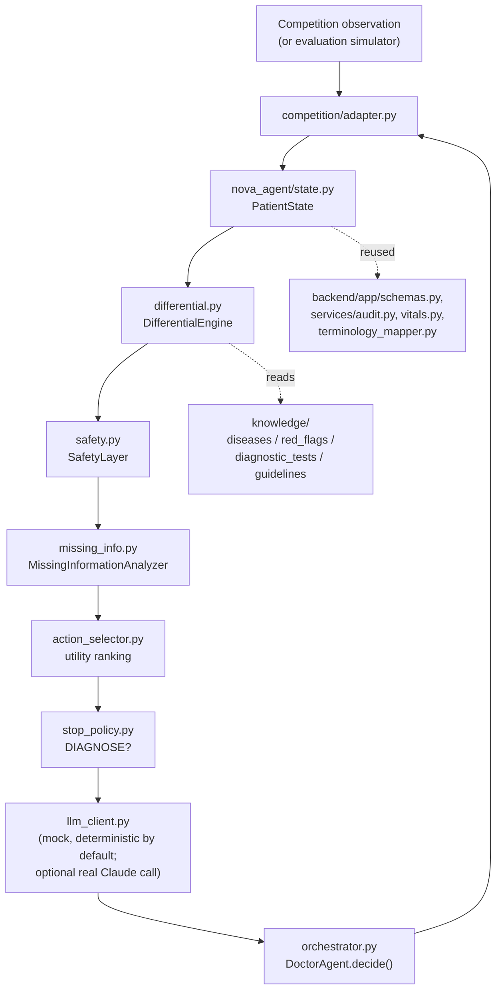

# N.O.V.A. 2026 Doctor Agent

A conversational medical-diagnosis agent (ASK / EXAM / TEST / DIAGNOSE) built as an independent
`nova_agent` module on top of the vendored **SynexAgent** medical decision-support backend
(`backend/`). It reasons iteratively from a limited initial presentation toward a differential
diagnosis, actively checks for time-critical ("can't-miss") conditions, and always submits a final
diagnosis within a hard 60-turn limit.

> No official N.O.V.A. 2026 Agent API/interface document was found in this repository or the
> materials available at implementation time. Everything competition-protocol-shaped lives behind
> `competition/adapter.py` + `competition/schema.py` (an explicit adapter pattern) so the real
> interface can be dropped in later without touching the clinical reasoning engine. See
> [Competition Adapter](#competition-adapter) below.

## 1. Architecture



Every turn: understand patient state → update differential → check dangerous diagnoses → find the
most valuable missing piece of information → pick ASK/EXAM/TEST/DIAGNOSE → record the result →
repeat. The deterministic engine (`differential.py` / `safety.py` / `missing_info.py` /
`action_selector.py` / `stop_policy.py`) is always the source of truth for *what* is safe and
useful to do next; `llm_client.py` only decides how that turn gets phrased/summarized, and its
output is clamped back onto the deterministic candidate list in `orchestrator.py`'s
`_reconcile()` so a hallucinated or malformed LLM response can never change agent behavior, only
its wording (see [Reliability](#8-reliability--determinism)).

### Module map

| Module | Spec section | Responsibility |
|---|---|---|
| `nova_agent/state.py` | 2 | `PatientState`, normalized dedup keys, turn accounting |
| `nova_agent/taxonomy.py` | 8/9/10 | Fixed ASK/EXAM/TEST catalogs (deterministic dedup source) |
| `nova_agent/clinical_summary.py` | 3 | Structured, deterministic per-turn summary (no raw transcript to the LLM) |
| `nova_agent/differential.py` | 4 | Top-K ranked differential with LOW/MEDIUM/HIGH confidence bands |
| `nova_agent/safety.py` | 5 | Dangerous-diagnosis safety layer (14 time-critical conditions) |
| `nova_agent/missing_info.py` | 6 | Scores candidate ASK/EXAM/TEST items on discrimination/safety/info-gain |
| `nova_agent/action_selector.py` | 7/8/9/10 | Utility-ranked action selection + DIAGNOSE candidate |
| `nova_agent/stop_policy.py` | 11 | DIAGNOSE-now decision + hard forced-diagnose fallback |
| `nova_agent/llm_schema.py` | 12 | Structured (Pydantic) LLM output schema |
| `nova_agent/llm_client.py` | 12/13/20/21 | Mock (deterministic) + optional Anthropic client, parse/repair/fallback |
| `nova_agent/diagnosis_normalizer.py` | 14 | Alias table → canonical diagnosis id (never guessed) |
| `nova_agent/knowledge/` | 15 | Offline disease/red-flag/test/guideline knowledge base + retrieval (RAG, feature-flagged) |
| `nova_agent/orchestrator.py` | — | `DoctorAgent`: ties everything into one per-turn `decide()`/`observe()` loop |
| `competition/adapter.py`, `schema.py` | 16 | The **only** files that should change when the official API ships |
| `evaluation/` | 17/18/24 | Synthetic cases, simulator, benchmark, ablation |
| `tests/test_nova_agent.py` | 23 | pytest suite |

## 2. Installation

nova_agent has almost no dependencies of its own -- it reuses a few pure-Python modules from the
vendored SynexAgent backend (patient/medication/allergy schemas, audit log, vitals, terminology
mapping) but needs none of FastAPI/ONNX Runtime/Redis to do so.

```bash
python3 -m venv .venv
source .venv/bin/activate
pip install -r requirements-nova.txt     # nova_agent + competition + evaluation only
```

To also run the full SynexAgent backend (FastAPI app, ONNX risk model, EMR/FHIR, etc. -- not
required for the competition agent itself):

```bash
pip install -r backend/requirements.txt -r backend/requirements-dev.txt
```

## 3. Local execution

```python
from nova_agent.orchestrator import DoctorAgent

agent = DoctorAgent()  # NOVA_LLM_PROVIDER=mock by default: fully offline, deterministic
state = agent.new_case("case1", "chest pain", demographics={"age": 58, "sex": "male"})

while True:
    action, llm_output, differential = agent.decide(state)   # ASK / EXAM / TEST / DIAGNOSE
    print(action.action_type, action.content)
    if action.action_type == "DIAGNOSE":
        break
    result = input("> ")            # in a real competition run, this comes from the environment
    agent.observe(state, action, result)

print("Final diagnosis:", state.final_diagnosis)
```

Or through the competition-shaped entrypoint (see [Competition Adapter](#competition-adapter)):

```python
from competition.adapter import NovaCompetitionAgent
agent = NovaCompetitionAgent()
action = agent.act({"case_id": "c1", "observation_type": "initial",
                     "chief_complaint": "chest pain", "demographics": {"age": 58, "sex": "male"}})
```

## 4. Benchmark

```bash
python -m evaluation.benchmark
```

Runs the 8 synthetic cases in `evaluation/cases.py` (one per required chief-complaint category:
chest pain, abdominal pain, headache, fever, dyspnea, dizziness, altered mental status, urinary
symptoms) and prints a per-case table plus summary (diagnostic accuracy, average turns, critical
miss rate, duplicate action rate, unnecessary tests, malformed LLM turns, failed-to-diagnose
count). These are hand-authored vignettes for local development only -- never real patient data.

Ablation (spec section 18):

```bash
python -m evaluation.ablation
```

Compares A (basic agent) → F (+ retrieval), reusing the real engine components with pieces
selectively disabled, so the table reflects each component's actual marginal contribution rather
than a separately-built toy baseline. See the module docstring for the important caveat about
stages A/B (no real differential) and F vs E (RAG only affects the optional real-LLM prompt path,
not the default deterministic mock).

Run the pytest suite:

```bash
pytest tests/test_nova_agent.py -v
```

## 5. Competition Adapter

`competition/adapter.py` + `competition/schema.py` are the **only** place a real N.O.V.A. 2026 API
should require changes. They translate:

```
competition observation  ->  nova_agent.state.PatientState
nova_agent.action_selector.AgentAction  ->  competition action
```

`competition/schema.py`'s `CompetitionObservation`/`CompetitionAction` are an explicit
**placeholder**, clearly marked as such in the module docstring, since no official schema was
available. When the real one is published:

1. Update (or replace) `CompetitionObservation`/`CompetitionAction` in `competition/schema.py`.
2. Update `observation_to_state()` / `action_to_competition()` in `competition/adapter.py`.
3. Nothing in `nova_agent/`, `evaluation/`, or `tests/` needs to change -- they only ever depend on
   `PatientState`/`AgentAction`, never on the competition schema.

`competition.adapter.NovaCompetitionAgent` is a thin, stateful `act(observation_dict) ->
action_dict` wrapper a real harness can drive directly, holding each case's `PatientState` by
`case_id` internally.

## 6. Configuration

All weights/thresholds/feature-flags live in `nova_agent/config.py` (a `NovaConfig` dataclass),
overridable via environment variables (see `.env.example`'s "N.O.V.A. Doctor Agent" section) --
never hardcoded in the reasoning modules, so local-benchmark or leaderboard feedback can retune
behavior without a code change:

- `NOVA_MAX_TURNS` (60), `NOVA_TOP_K_DIFFERENTIAL` (5)
- `NOVA_INFO_GAIN_WEIGHT`, `NOVA_DISCRIMINATION_WEIGHT`, `NOVA_SAFETY_WEIGHT`,
  `NOVA_MANAGEMENT_RELEVANCE_WEIGHT`, `NOVA_TURN_COST`, `NOVA_REDUNDANCY_PENALTY` -- the
  action-selection utility formula's weights (spec section 7)
- `NOVA_DIAGNOSE_THRESHOLD`, `NOVA_MIN_GAP_RANK1_RANK2`, `NOVA_FORCED_DIAGNOSE_REMAINING_TURNS` --
  the stop policy (spec section 11)
- `NOVA_RAG_ENABLED`, `NOVA_RAG_TOP_K` -- the offline knowledge retrieval feature flag (section 15)
- `NOVA_LLM_PROVIDER` (`mock` default / `anthropic`), `NOVA_LLM_MODEL`, `NOVA_LLM_TEMPERATURE`,
  `NOVA_LLM_MAX_RETRIES`, `NOVA_LLM_TIMEOUT_SECONDS`
- `NOVA_RANDOM_SEED` -- determinism (section 21)

## 7. Directory structure

```
nova_agent/                  Independent clinical reasoning engine (no UI dependency)
  state.py                   PatientState + normalized dedup keys
  taxonomy.py                Fixed ASK/EXAM/TEST catalogs
  chief_complaint.py         Free-text chief complaint -> fixed tag classifier
  matching.py                Shared feature/finding keyword-overlap matcher
  differential.py            Differential Diagnosis Engine
  safety.py                  Dangerous Diagnosis Safety Layer
  missing_info.py            Missing Information Analyzer
  action_selector.py         Action Candidate Generator + utility ranking
  stop_policy.py             Stop / Diagnose Policy
  clinical_summary.py        Structured per-turn clinical summary
  llm_schema.py               Structured LLM output schema (Pydantic)
  llm_client.py               Mock (deterministic) + optional Anthropic LLM client
  diagnosis_normalizer.py     Alias table -> canonical diagnosis id
  logging_store.py            Case logging (reuses backend AuditStore)
  orchestrator.py             DoctorAgent: per-turn decide()/observe() loop
  config.py                   All weights/thresholds/feature-flags
  knowledge/                  Offline medical knowledge base + retrieval
    diseases/*.json             14 time-critical + 10 common diagnoses
    red_flags/critical_conditions.json
    diagnostic_tests/notes.json
    guidelines/chief_complaint_guidelines.json
    retrieval.py
competition/                 Competition integration (adapter pattern)
  schema.py                   Placeholder observation/action shapes
  adapter.py                   Translation + NovaCompetitionAgent entrypoint
evaluation/                  Local benchmark harness (synthetic cases only)
  cases.py, simulator.py, benchmark.py, ablation.py
tests/
  test_nova_agent.py          pytest suite (spec section 23)
backend/, frontend/, docs/,   Vendored SynexAgent (medical decision-support system this agent
config/, docker/, scripts/,   reuses patient-data schemas / audit / vitals / terminology-mapping
research/                     from) -- unmodified, its own test suite still passes as-is.
requirements-nova.txt        nova_agent-only dependencies (pydantic; anthropic is optional)
```

## 8. Reliability & determinism

- **Never crashes the run**: `DoctorAgent.decide()` catches any internal exception and falls back
  to a safe action (ask a baseline question / take vitals / forced diagnose if turns are nearly
  exhausted); `DoctorAgent.observe()` validates EXAM/TEST keys against the known catalogs and
  unknown action types before recording.
- **Malformed LLM output**: `llm_client.parse_agent_turn_output()` tolerates markdown fences /
  surrounding prose, validates against the Pydantic schema, and returns `None` (never raises) on
  any failure; the orchestrator then uses the deterministic action untouched.
- **Turn limit**: `stop_policy.py` forces `DIAGNOSE` once `remaining_turns <=
  NOVA_FORCED_DIAGNOSE_REMAINING_TURNS` (default 3), so a final diagnosis is always submitted
  before the hard 60-turn cap.
- **Duplicate actions**: `PatientState.is_duplicate()` / `question_asked()` / `exam_done()` /
  `test_done()` are checked before a candidate is even generated (`missing_info.py`), not just
  before submission -- the agent structurally cannot re-ask/re-order the same catalog item twice.
- **Determinism**: `NOVA_RANDOM_SEED` fixes any randomness in the evaluation harness,
  `NOVA_LLM_TEMPERATURE=0.0` by default, diagnosis normalization is table-driven (not fuzzy), and
  the default `mock` LLM provider is a pure function of already-computed deterministic state.

## 9. Troubleshooting

- **`ModuleNotFoundError: No module named 'app'`** when importing `nova_agent`: nova_agent expects
  the vendored `backend/` directory to exist alongside it (see `nova_agent/_synex.py`, which
  inserts `backend/` onto `sys.path`). If you copied `nova_agent/` out of this repo standalone,
  either bring `backend/app/{schemas,services/{audit,vitals,terminology_mapper}}.py` with it, or
  see `nova_agent/_synex.py`'s fallback stubs (it degrades gracefully, but `Allergy`/`Medication`/
  `VitalSigns` become `None` and PatientState's medication/allergy fields will error on
  construction -- only safe if you also adapt `state.py` to not use them).
- **`python -m evaluation.benchmark` / `ablation` import errors**: run from the repository root
  (they're modules, not scripts: `python -m evaluation.benchmark`, not `python
  evaluation/benchmark.py`), and make sure `requirements-nova.txt` is installed.
- **3D anatomy viewer assets missing**: `frontend/public/models/anatomy/` (~80MB of GLB assets)
  was intentionally excluded when vendoring SynexAgent into this repo, since the competition Doctor
  Agent has no UI dependency (spec section 22) and the assets are unrelated to backend or agent
  logic. Regenerate them with `python build_real_anatomy.py` (see `docs/ANATOMY.md`) or fetch them
  from the original `hundol047/YMAS-GPT-6-Astra` repository if you need the 3D workspace UI.
- **`NOVA_LLM_PROVIDER=anthropic` silently falls back to deterministic output**: this is by
  design on any SDK-missing/no-API-key/network/parsing failure (see
  `nova_agent/llm_client.py`'s `AnthropicLLMClient`) -- check the `nova_agent.llm` logger for the
  specific reason (`pip install anthropic`, missing `ANTHROPIC_API_KEY`, etc.).
- **Backend (SynexAgent) tests fail after modifying `nova_agent/`**: they shouldn't -- `backend/`
  never imports from `nova_agent/` or `competition/` (only the reverse). Run `pytest backend/tests`
  in isolation to confirm; if it fails, the regression is in `backend/`, not in this agent.
