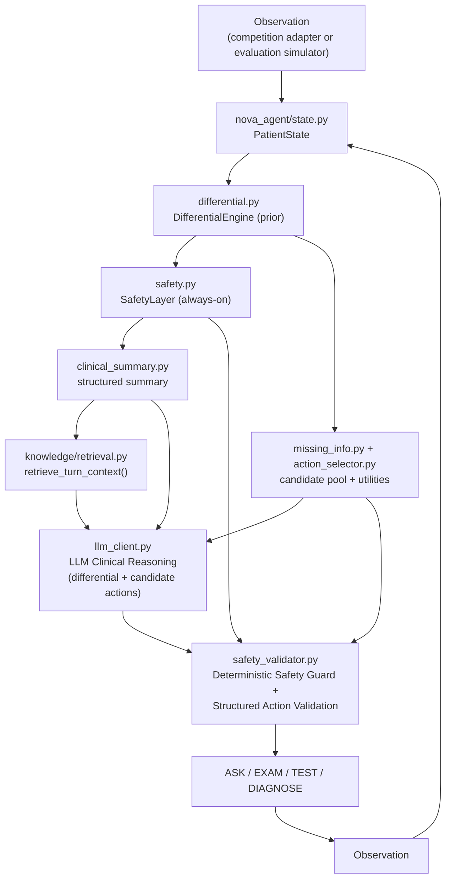

# N.O.V.A. 2026 Doctor Agent

A conversational medical-diagnosis agent (ASK / EXAM / TEST / DIAGNOSE) built as an independent,
**standalone** `nova_agent` module. It reasons iteratively from a limited initial presentation
toward a differential diagnosis, actively checks for time-critical ("can't-miss") conditions, and
always submits a final diagnosis within a hard 60-turn limit.

Everything below describes verified, executed behavior (pytest, `evaluation.benchmark`,
`evaluation.ablation`, `evaluation.adversarial`, and a real standalone subprocess run of
`submission/`) -- see [Known Limitations](#10-known-limitations) for what is *not* yet verified.

> No official N.O.V.A. 2026 Agent API/interface document was found in this repository or the
> materials available at implementation time. Everything competition-protocol-shaped lives behind
> `competition/adapter.py` + `competition/schema.py` (an explicit adapter pattern) so the real
> interface can be dropped in later without touching the clinical reasoning engine. See
> [Competition Adapter](#5-competition-adapter) below.

## 1. Architecture



**This is a real LLM-Clinical-Reasoning + Deterministic-Safety-Guard hybrid, not a deterministic
engine that merely gets rephrased by an LLM.** Concretely:

- The deterministic engine (`differential.py` / `safety.py` / `missing_info.py` /
  `action_selector.py`) always runs first and produces a *prior* differential, safety findings,
  and a scored, legal candidate pool (every non-duplicate ASK/EXAM/TEST the knowledge base
  supports this turn, not just one "correct" pick).
- `llm_client.py` is handed that prior, the structured clinical summary, and RAG-retrieved
  knowledge snippets, and may: re-rank the differential, add supporting/contradictory evidence,
  **introduce a diagnosis that isn't in the local knowledge base at all**, and select *any* legal
  candidate action -- not only the highest-utility one.
- `safety_validator.py` (spec section 2's "Deterministic Safety Guard + Structured Action
  Validation") is the **only** place that ever overrides the LLM, and only for a short, explicit
  list of hard violations: a diagnosis submitted while a dangerous, unresolved, not-yet-worked-up
  alternative exists; a duplicate action; an unknown/hallucinated action key; an unrecognized
  action type; no usable LLM output at all (malformed/timeout/exception); or the turn limit. Any
  currently-active `SafetyFinding` is guaranteed to stay in the differential even if the LLM
  dropped it. Everything else the LLM chooses is executed as-is.

This is proven, not just asserted: `tests/test_hybrid_and_robustness.py::test_llm_can_change_differential`
feeds a scripted LLM client that introduces "Boerhaave Syndrome" (not in the knowledge base) and
confirms it appears in the resulting differential;
`test_llm_can_select_valid_non_deterministic_candidate` feeds a client that deliberately picks the
*lowest*-utility legal ASK candidate and confirms that (not the deterministic top pick) is what
gets executed; `test_safety_guard_blocks_unsafe_llm_action` confirms a premature DIAGNOSE with
unresolved dangerous alternatives gets blocked regardless of the LLM's own confidence.

### Module map

| Module | Spec section | Responsibility |
|---|---|---|
| `nova_agent/models.py` | 17 | Standalone `Medication`/`Allergy`/`VitalSigns` (no backend dependency) |
| `nova_agent/state.py` | 2 | `PatientState`, normalized dedup keys, clause-level negation parsing |
| `nova_agent/vitals_parser.py` | 5/24D | Regex extraction of BP/HR/RR/Temp/SpO2 into structured `VitalSigns` |
| `nova_agent/taxonomy.py` | 8/9/10 | Fixed ASK/EXAM/TEST catalogs (deterministic dedup source) |
| `nova_agent/chief_complaint.py` | 8 | Free-text -> tag classifier (15 tags + related-tag fallback, not 8 closed categories) |
| `nova_agent/matching.py` | 9/10 | Shared feature/finding keyword-overlap matcher |
| `nova_agent/clinical_summary.py` | 3 | Structured, deterministic per-turn summary (no raw transcript to the LLM) |
| `nova_agent/differential.py` | 4/9 | Prior differential: LOW/MEDIUM/HIGH bands, negatively-phrased-feature-aware scoring |
| `nova_agent/safety.py` | 5/15 | Symptom/vital/demographic/medication-risk dangerous-diagnosis detection |
| `nova_agent/missing_info.py` | 6/10 | Real entropy-based expected-information-gain candidate scoring |
| `nova_agent/action_selector.py` | 7/8/9/10/11 | Utility-ranked candidate pool (not a single winner) |
| `nova_agent/semantic_dedup.py` | 12 | 3-layer duplicate detection (id / category / keyword fallback) |
| `nova_agent/stop_policy.py` | 11 | DIAGNOSE-now decision + hard forced-diagnose fallback |
| `nova_agent/llm_schema.py` | 12 | Structured (Pydantic) LLM output schema, key-based action selection |
| `nova_agent/llm_client.py` | 2/3/12/13/20/21 | Mock / Anthropic / OpenAI-compatible / Local / Competition providers |
| `nova_agent/safety_validator.py` | 2/24A | Deterministic Safety Guard + Structured Action Validation |
| `nova_agent/diagnosis_normalizer.py` | 14 | Alias table -> canonical diagnosis id (never guessed) |
| `nova_agent/knowledge/` | 15 | 34-diagnosis offline knowledge base + RAG retrieval (feature-flagged) |
| `nova_agent/orchestrator.py` | 2/13/20 | `DoctorAgent`: the full turn pipeline above |
| `competition/adapter.py`, `schema.py` | 16 | The **only** files that should change when the official API ships |
| `evaluation/` | 17/18/19/20/21/22 | Tuning + held-out cases, simulator, benchmark, ablation, adversarial, tune |
| `submission/` | 16/24I | Standalone, backend-independent deployable package (`run.py` entrypoint) |
| `tests/` | 23 | pytest suite (36 tests) |

## 2. Installation

nova_agent has **no required dependency on the vendored SynexAgent backend at all**
(`nova_agent/models.py` defines its own `Medication`/`Allergy`/`VitalSigns`; the optional reuse of
backend's `AuditStore`/terminology mapper in `nova_agent/_synex.py` degrades to a harmless no-op
when `backend/` is absent -- see `tests/test_hybrid_and_robustness.py::test_standalone_without_backend`).

```bash
python3 -m venv .venv
source .venv/bin/activate
pip install -r requirements-nova.txt       # runtime only: pydantic (+ optional openai/anthropic)
pip install -r requirements-nova-dev.txt   # adds pytest, for running the test suite
```

To also run the full SynexAgent backend (FastAPI app, ONNX risk model, EMR/FHIR, etc. -- not
required for the competition agent itself):

```bash
pip install -r backend/requirements.txt -r backend/requirements-dev.txt
```

## 3. Local execution

```python
from nova_agent.orchestrator import DoctorAgent

agent = DoctorAgent()  # NOVA_LLM_PROVIDER=mock by default: fully offline, deterministic
state = agent.new_case("case1", "chest pain", demographics={"age": 58, "sex": "male"})

while True:
    action, llm_output, differential = agent.decide(state)   # ASK / EXAM / TEST / DIAGNOSE
    print(action.action_type, action.content)
    if action.action_type == "DIAGNOSE":
        break
    result = input("> ")            # in a real competition run, this comes from the environment
    agent.observe(state, action, result)

print("Final diagnosis:", state.final_diagnosis)
```

Or through the competition-shaped entrypoint (see [Competition Adapter](#5-competition-adapter)):

```python
from competition.adapter import NovaCompetitionAgent
agent = NovaCompetitionAgent()
action = agent.act({"case_id": "c1", "observation_type": "initial",
                     "chief_complaint": "chest pain", "demographics": {"age": 58, "sex": "male"}})
```

## 4. Benchmark & Evaluation

```bash
python -m evaluation.benchmark          # tuning set + held-out set, full metrics
python -m evaluation.benchmark --held-out-only
python -m evaluation.ablation           # A (basic) -> F (+retrieval) component contribution
python -m evaluation.adversarial        # 12 crash-resistance / reliability checks
python -m evaluation.tune --random 20   # local weight calibration (tuning set only, never held-out)
pytest tests/ -v                        # 36 tests
```

**`evaluation/cases.py`** (8 cases, one per required chief-complaint category) is the *tuning set*
the current `nova_agent/config.py` defaults were iterated against. **`evaluation/held_out_cases.py`**
(12 cases: paraphrases, age/sex variation, an ambiguous case, a dangerous mimic, a benign mimic, a
negative-finding-centric case, insufficient information, noisy free text, an unmapped chief
complaint, and a Korean-language case) was **never** used to tune any default -- it exists
specifically to measure generalization. All cases are hand-authored synthetic vignettes, never real
patient data.

### Latest results (this branch, `NOVA_LLM_PROVIDER=mock`)

| Set | Diagnostic Accuracy | Critical Miss Rate | Avg Turns | Duplicate Rate |
|---|---|---|---|---|
| Tuning (8 cases) | 100.0% | 0.0% | 11.1 | 0.00 |
| Held-out (12 cases, 9 scored) | 88.9% (8/9) | 14.3% (1/7 critical) | 20.8 | 0.00 |

The one held-out miss (`Dizziness02_NegativeFindingCentric`) confuses two clinically overlapping
**benign** syncope-spectrum diagnoses (vasovagal syncope vs. orthostatic hypotension) -- not a
dangerous miss. The one held-out critical miss (`Unknown01_UnmappedComplaint`, a deliberately
unmapped chief complaint, excluded from the accuracy denominator) confuses a severe electrolyte
disorder with a cardiac arrhythmia it causes -- see [Known Limitations](#10-known-limitations).

Ablation table (`python -m evaluation.ablation`):

| Stage | Accuracy | Avg Turns | Critical Miss |
|---|---|---|---|
| A. Basic Agent (fixed checklist, no differential) | 37.5% | 7.0 | 66.7% |
| B. + Patient State (dedup) | 37.5% | 7.0 | 66.7% |
| C. + Differential Engine | 100.0% | 7.0 | 0.0% |
| D. + Info-Gain Selection | 100.0% | 8.1 | 0.0% |
| E. + Safety Layer | 100.0% | 11.2 | 0.0% |
| F. + Retrieval | 100.0% | 11.2 | 0.0% |

F vs. E shows no metric difference under the default `mock` provider by construction: retrieval
only feeds the real-LLM prompt (`llm_client.build_reasoning_prompt`), which `mock` never
constructs. `tests/test_hybrid_and_robustness.py::test_rag_context_reaches_llm` verifies the
retrieved snippets DO reach that prompt when a real/scripted client is used.

## 5. Competition Adapter

`competition/adapter.py` + `competition/schema.py` are the **only** place a real N.O.V.A. 2026 API
should require changes. They translate:

```
competition observation  ->  nova_agent.state.PatientState
nova_agent.action_selector.AgentAction  ->  competition action
```

`competition/schema.py`'s `CompetitionObservation`/`CompetitionAction` are an explicit
**placeholder**, clearly marked as such in the module docstring, since no official schema was
available. When the real one is published:

1. Update (or replace) `CompetitionObservation`/`CompetitionAction` in `competition/schema.py`.
2. Update `observation_to_state()` / `action_to_competition()` in `competition/adapter.py`.
3. Nothing in `nova_agent/`, `evaluation/`, `submission/`, or `tests/` needs to change -- they only
   ever depend on `PatientState`/`AgentAction`, never on the competition schema.

`competition.adapter.NovaCompetitionAgent` is a thin, stateful `act(observation_dict) ->
action_dict` wrapper a real harness can drive directly, holding each case's `PatientState` by
`case_id` internally.

## 6. Competition submission package

`submission/` is a minimal, **verified-standalone** copy of `nova_agent/` + `competition/` plus a
hand-authored `run.py` entrypoint and `requirements.txt` -- no `backend/`, `frontend/`, `docs/`,
`tests/`, or any other part of this repository is required.

```
submission/
  run.py             # JSON-lines protocol on stdin/stdout, or --interactive for a terminal demo
  requirements.txt    # pydantic only by default
  nova_agent/          # copied from the repo root (single source of truth)
  competition/          # copied from the repo root
```

Regenerate it after any change to `nova_agent/` or `competition/`:

```bash
python scripts/build_nova_submission.py
```

Verified standalone: `tests/test_hybrid_and_robustness.py::test_submission_run_entrypoint` runs
`submission/run.py` as a real subprocess with a minimal environment (no inherited `PYTHONPATH`,
`cwd=submission/`) and confirms it produces a valid JSON action. This was also manually verified by
copying `submission/` alone into an empty temp directory, installing only `requirements.txt` into a
fresh virtualenv, and running a full 18-turn case to DIAGNOSE with no other project files present.

```bash
echo '{"case_id": "c1", "observation_type": "initial", "chief_complaint": "chest pain", "demographics": {"age": 58, "sex": "male"}}' \
  | python submission/run.py
```

## 7. LLM Model Runtime

`NOVA_LLM_PROVIDER` (env var / `nova_agent/config.py`) selects the reasoning provider:

| Provider | Requires | Notes |
|---|---|---|
| `mock` (default) | nothing | Fully offline, deterministic; used by the benchmark/ablation/adversarial harness |
| `anthropic` | `anthropic` package + `ANTHROPIC_API_KEY` | Real Claude call |
| `openai_compatible` | `openai` package + `NOVA_LLM_BASE_URL`/`NOVA_LLM_MODEL` | Any OpenAI Chat Completions-compatible HTTP server -- local (vLLM/llama.cpp/ollama) or hosted |
| `local` | `openai` package | Alias of `openai_compatible`, documents a no-internet local deployment |
| `competition` | `openai` package + `NOVA_COMPETITION_*` env vars | Alias of `openai_compatible` reading a separate, competition-specific config block so the real runtime endpoint can be set without touching local dev settings |

Every real provider falls back to the deterministic `mock` output on any SDK/network/parsing
failure (never raises -- see `evaluation.adversarial`'s `llm_malformed_json`/`llm_timeout`/
`llm_unavailable_full_case` checks, all passing). `NOVA_COMPETITION_MODEL` defaults to
`openai/gpt-oss-20b` (the model named in the publicly discussed N.O.V.A. qualifier requirements at
implementation time) served through a local/offline OpenAI-compatible endpoint -- override every
`NOVA_COMPETITION_*` value once the official rules are published; no code changes needed.

**Not yet verified**: no live `openai_compatible`/`local`/`competition`/`anthropic` call has been
exercised end-to-end in this environment (no GPU, no model weights, no API keys available at
implementation time). The HTTP integration code, prompt construction, and parse/repair/fallback
path ARE unit-tested (`tests/test_hybrid_and_robustness.py`, `tests/test_nova_agent.py`'s
`test_invalid_llm_output*`), but a real gpt-oss-20b (or Claude) response has not been observed.

## 8. RAG

`nova_agent/knowledge/retrieval.py`'s `retrieve_turn_context()` assembles, per turn: the current
chief-complaint guideline sentence, a one-line note per dangerous diagnosis in the top-3
differential, and short clinical notes for the specific tests under consideration this turn --
never the whole knowledge base. Feature-flagged via `NOVA_RAG_ENABLED` (default on). Every snippet
carries a `source` tag for provenance. It reaches the real-LLM prompt via
`llm_client.build_reasoning_prompt()`; the default `mock` provider never constructs that prompt (it
skips straight to repackaging already-computed state), which is why ablation stage F shows no
metric delta over E under `mock` -- see the caveat in section 4 above.

## 9. Safety

`nova_agent/safety.py` combines four independent trigger types, all chief-complaint-tag-gated
(never a blanket check across unrelated presentations):

1. **Symptom keyword overlap** against each of the 14 time-critical diagnoses' `red_flag_keywords`.
2. **Vital-sign thresholds** (tachycardia/hypotension/tachypnea/hypoxia/fever) read from
   `state.vital_signs`, which `vitals_parser.py` populates from the EXAM's raw text.
3. **Demographic risk** (e.g. reproductive-age female + abdominal pain -> ectopic pregnancy
   considered even before any pregnancy-specific symptom is mentioned).
4. **Medication risk** (e.g. anticoagulant use + headache -> intracranial hemorrhage risk raised;
   NSAID/antiplatelet/anticoagulant use + abdominal pain -> GI bleeding risk raised).

Any diagnosis flagged by SafetyLayer is guaranteed to stay in the differential
(`safety_validator.merge_differential`) even if the LLM's own differential dropped it, and a
DIAGNOSE is blocked by `safety_validator.validate_action` while any flagged dangerous alternative
remains both unresolved (no contradictory evidence against it) and not yet worked up (its
discriminating exams/tests haven't all been done).

## 10. Known Limitations

- **Knowledge base breadth**: 34 diagnoses across 15 chief-complaint tags (with a related-tag
  fallback for presentations like syncope/palpitations/vomiting/weakness/cough/back
  pain/leg swelling that don't have their own dedicated pool). This is far from exhaustive
  differential medicine; the LLM reasoning layer can introduce diagnoses outside this set (verified
  by `test_llm_can_change_differential`), but the deterministic prior/candidate-generation and
  offline knowledge base only cover these 34.
- **Held-out accuracy is 88.9%, not 100%** (see section 4) -- both misses are disclosed above
  rather than tuned away; the knowledge base was deliberately NOT adjusted to force
  `Unknown01_UnmappedComplaint` (a stress case for the unmapped-complaint fallback, not a fair
  differential-accuracy test) to pass.
- **`unnecessary_tests` metric is a heuristic**: tests outside the ground-truth disease's (or a
  chief-complaint-relevant critical disease's) `discriminating_tests` list are counted as
  "unnecessary," which can under- or over-count legitimately safety-driven tests for a mimic case
  (e.g. ordering an ECG when the true diagnosis is GERD is appropriate risk-reduction, not waste).
- **No live real-LLM call observed** (section 7) -- the integration code is implemented and
  unit-tested with scripted/mocked clients, not exercised against a live gpt-oss-20b or Claude
  response in this environment.
- **Matching is keyword/entropy-based, not an NLP/embedding model** (`matching.py`,
  `missing_info.py`) -- deliberately, for determinism and testability (spec section 21), but it
  will miss synonym pairs neither stemmed nor keyword-matched.
- **`evaluation.tune`'s search space is small** (3 weights) and only optimizes against the 8-case
  tuning set; it is a starting point for manual calibration, not an automated tuner.
- **`main` branch**: as of this work, the implementation lives on this feature branch; `main` was
  effectively empty when this branch was created. See the session's final report for the current
  PR/merge status.

## 11. Directory structure

```
nova_agent/                  Independent, standalone clinical reasoning engine (no backend/UI dependency)
  models.py                   Standalone Medication/Allergy/VitalSigns
  state.py                    PatientState + clause-level negation parsing + normalized dedup keys
  vitals_parser.py             Free-text vitals -> structured VitalSigns
  taxonomy.py                  Fixed ASK/EXAM/TEST catalogs
  chief_complaint.py           Free-text -> tag classifier (15 tags + related-tag fallback)
  matching.py                  Shared feature/finding keyword-overlap matcher
  differential.py              Differential Diagnosis Engine (prior)
  safety.py                    Dangerous Diagnosis Safety Layer
  missing_info.py               Entropy-based Missing Information Analyzer
  action_selector.py            Candidate pool + utility scoring
  semantic_dedup.py             3-layer duplicate detection
  stop_policy.py                Stop / Diagnose Policy
  clinical_summary.py           Structured per-turn clinical summary
  llm_schema.py                  Structured LLM output schema (Pydantic)
  llm_client.py                  Mock / Anthropic / OpenAI-compatible / Local / Competition clients
  safety_validator.py            Deterministic Safety Guard + Structured Action Validation
  diagnosis_normalizer.py        Alias table -> canonical diagnosis id
  logging_store.py               Case logging (reuses backend AuditStore when present)
  orchestrator.py                DoctorAgent: full turn pipeline
  config.py                      All weights/thresholds/feature-flags
  knowledge/                     Offline medical knowledge base + retrieval (34 diagnoses)
competition/                  Competition integration (adapter pattern)
evaluation/                   Local benchmark harness (synthetic cases only)
  cases.py                      Tuning set (8 cases)
  held_out_cases.py              Held-out set (12 cases, never used to tune defaults)
  simulator.py, benchmark.py, ablation.py, adversarial.py, tune.py
submission/                   Standalone, backend-independent deployable package
  run.py, requirements.txt, nova_agent/, competition/
scripts/build_nova_submission.py   Regenerates submission/{nova_agent,competition}/
tests/                        pytest suite (36 tests)
backend/, frontend/, docs/,   Vendored SynexAgent (medical decision-support system nova_agent
config/, docker/, scripts/,   optionally reuses AuditStore/terminology-mapping from when backend/
research/                     is present) -- unmodified, its own 267-test suite still passes as-is.
requirements-nova.txt         nova_agent runtime dependencies (pydantic; openai/anthropic optional)
requirements-nova-dev.txt     + pytest
```

## 12. Troubleshooting

- **`python -m evaluation.benchmark` / `ablation` / `adversarial` / `tune` import errors**: run
  from the repository root as modules (`python -m evaluation.benchmark`, not
  `python evaluation/benchmark.py`), with `requirements-nova-dev.txt` installed.
- **3D anatomy viewer assets missing**: `frontend/public/models/anatomy/` (~80MB of GLB assets)
  was intentionally excluded when vendoring SynexAgent into this repo, since the competition Doctor
  Agent has no UI dependency and the assets are unrelated to backend or agent logic. Regenerate
  with `python build_real_anatomy.py` (see `docs/ANATOMY.md`) or fetch them from the original
  `hundol047/YMAS-GPT-6-Astra` repository if you need the 3D workspace UI.
- **A real LLM provider silently falls back to deterministic output**: by design on any
  SDK-missing/no-API-key/network/parsing failure (see `nova_agent/llm_client.py`) -- check the
  `nova_agent.llm` logger for the specific reason.
- **`submission/` is stale after editing `nova_agent/`**: run
  `python scripts/build_nova_submission.py` to resync it (it copies from the repo root, the single
  source of truth -- `submission/nova_agent/` and `submission/competition/` are never hand-edited).
- **Backend (SynexAgent) tests fail after modifying `nova_agent/`**: they shouldn't -- `backend/`
  never imports from `nova_agent/` or `competition/` (only the optional reverse, in
  `nova_agent/_synex.py`). Run `pytest backend/tests` in isolation to confirm; if it fails, the
  regression is in `backend/`, not in this agent.
