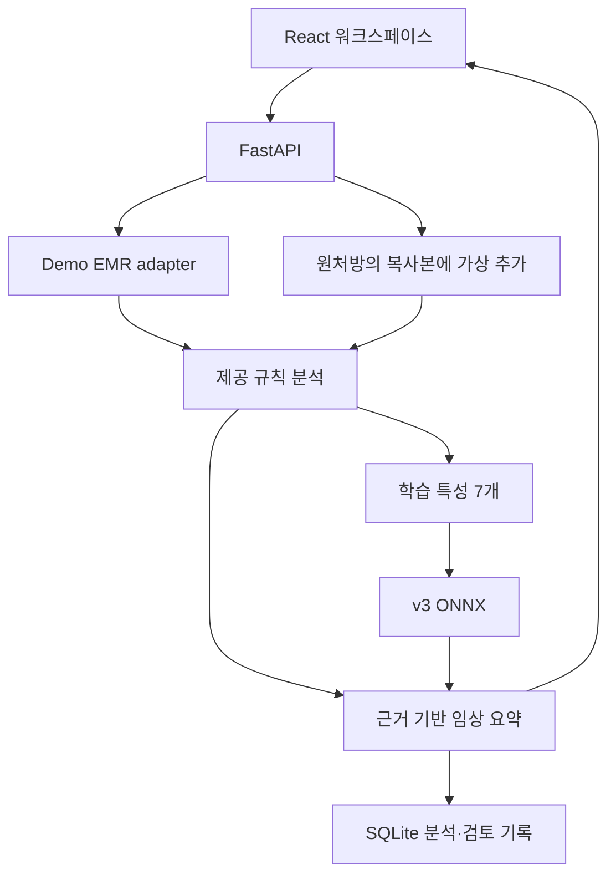

# 아키텍처

React + Vite 클라이언트는 모든 분석·시뮬레이션을 FastAPI에 요청합니다. 브라우저가 위험 점수를 직접 계산하지 않습니다. 운영 빌드에서는 FastAPI가 frontend/dist와 API를 같은 origin에서 제공합니다.

## 판단 분리

1. 원본 `build_dataset_v2.audit`와 동일한 상호작용·약물군·기저질환·알레르기 규칙을 먼저 집계합니다.
2. 이 danger/caution만 drug_conflict로 전달합니다. 다약제와 중증 이력은 독립 feature로 전달합니다.
3. 신규 중복 성분 후보·검사범위·누적 경고 카드는 별도로 표시하여 모델 feature에 중복 가산하지 않습니다.
4. 모델 점수와 규칙 경고는 각각 반환합니다. 모델 저위험도 규칙 경고를 지우지 않습니다.
5. 임상 요약은 검출 결과와 누락 정보에서 생성됩니다. LLM이 새 금기나 대체약을 생성하는 구조는 없습니다.

## 동작과 기록

분석마다 UUID, model/rules SHA256, UTC timestamp를 기록합니다. 경고 ID는 유형·약물·출처·근거로 결정되어 전후 비교가 가능합니다. 검토 요청은 해당 분석에 존재하는 경고만 허용합니다. SQLite에는 이벤트와 분석 snapshot을 저장합니다. 현재는 데모 단일 사용자이므로 인증된 의사 식별과 위변조 방지는 구현하지 않았습니다.

시뮬레이션은 adapter의 deep copy를 사용합니다. 새 약물이 실제 환자 데이터에 저장되지 않으며 자동 처방 endpoint도 없습니다. 입력 schema는 미등록 필드, 0~1 범위 밖 feature, 비유한 숫자와 잘못된 약물을 거절합니다. 미등록 약물이 `/medication-check`에 들어오면 미매칭 사실을 표시합니다.

화면의 단계 애니메이션은 서버에서 완료된 단계 결과를 순서대로 재생합니다. 실제 처리 시간은 별도 표시합니다. 실시간 스캔 시간을 가장하지 않습니다. 환자 전환 시 EventSource·타이머·요청을 정리하고 epoch를 검사하여 이전 결과가 새 환자를 덮어쓰지 않도록 합니다.

## 운영 확장

현재 localhost 데모용입니다. 병원 적용 전 인증/RBAC, 접근 기록, 암호화·보존 정책, 데이터 표준 매핑, 약물 지식베이스 검증, 의료진 사용성 검증, 시간적·외부 임상 검증이 필요합니다. CORS는 접근 인증을 대체하지 않습니다. SQLite 기록은 현재 감사 이력의 개념 검증이며 법적 감사 시스템이 아닙니다.
